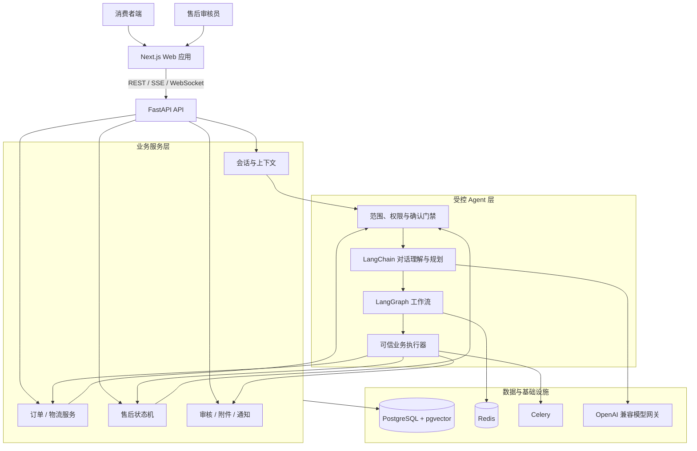

# 店小服 ShopCare｜智能电商客服与售后 Agent

> 一个面向电商售前咨询、订单服务与售后协同的全栈 AI Agent 项目：自然语言对话、可信业务执行、状态管理与人工审核共同组成可追踪的服务闭环。

     

## 这是什么

ShopCare 模拟一条电商客户服务链路：消费者咨询商品与平台规则、查询本人订单和物流、发起售后并补充凭证；审核员在工作台查看订单、对话、附件和历史记录后完成审核。

🎬 **[3分钟看懂店小服 ShopCare](https://qrwuu.github.io/shopcare-ai-agent/project-intro.html?v=original-1080p)**

核心问题是：**如何让 AI 客服理解自然语言，又能在正确订单、规则和状态边界内完成服务。**

## 产品设计

店小服以“对话承接、事实核验、受控执行、状态回流”为主线，覆盖商品与政策咨询、订单与物流服务、售后申请、人工审核和进度跟进。

产品资料：[完整 PRD](docs/ShopCare_PRD.md) · [PRD 精简版](docs/ShopCare_PRD_精简版.md) · [产品迭代与关键决策](docs/PRODUCT_DECISIONS.md)

## 产品亮点

| 能力 | 用户获得什么 |
| --- | --- |
| 自然语言服务入口 | 用一句话描述商品、规则、订单、物流或售后问题；需要办理时再选择对应订单，不必先在多个页面寻找入口。 |
| 订单锚定与受控办理 | 查询只返回本人订单；取消、改址、拦截和售后提交先展示影响、请求确认，再由服务端核验归属、状态与参数。 |
| 可持续跟进的售后闭环 | 申请、图片凭证、退货单号、时间线和通知围绕同一售后记录同步；刷新或重新登录后仍可查看进度与下一步。 |
| 人工审核协同 | 复杂或证据不足的申请进入审核队列；审核员在订单、会话、附件与历史齐备的上下文中处理，结论同步回消费者端。 |

## 能力地图

| 场景 | 用户能做什么 | 系统如何保障 |
| --- | --- | --- |
| 商品与政策咨询 | 商品推荐、规格/库存追问、退换货、运费和价保规则咨询。 | 目录与政策内容提供事实；通用咨询不误绑定具体订单。 |
| 订单、物流与履约 | 查询本人订单和物流、催发货、取消、改址、申请拦截。 | 订单归属、状态与确认由服务端校验。 |
| 售后申请与进度 | 退货退款、仅退款、换货、少件、错发、破损、凭证与退货单号。 | 状态机、时间线与通知同步处理进度；材料不足时引导补充。 |
| 人工审核 | 查看任务、订单、对话和附件，完成通过、拒绝或补材料。 | 审核结论同步回消费者对话、售后记录和通知。 |

## 系统架构



### 受控服务设计

1. **模型负责理解与表达：** 识别意图、承接上下文、追问缺失信息并组织答复。
2. **服务端确认业务事实：** 订单归属、金额、物流、资格和状态由订单、售后与规则服务返回。
3. **关键动作经过确认与校验：** 取消、改址、拦截和售后提交在用户确认后重新校验；复杂申请进入审核队列。

## 快速体验

### 运行环境

- Docker Engine 与 Docker Compose v2
- Node.js 20+
- 可用的 OpenAI 兼容模型网关

### 1. 获取与配置项目

```bash
git clone https://github.com/qrwuu/shopcare-ai-agent.git
cd shopcare-ai-agent

cp backend/.env.example backend/.env
cp web/.env.example web/.env.local
```

编辑 `backend/.env`，至少填写：

```dotenv
OPENAI_BASE_URL=https://your-openai-compatible-endpoint/v1
OPENAI_API_KEY=your-api-key
LLM_MODEL=your-chat-model
SECRET_KEY=replace-with-a-long-random-secret
```

### 2. 启动后端与基础设施

```bash
docker compose up -d --build
docker compose exec app python scripts/seed_data.py
```

启动后可访问：

- API 健康检查：`http://localhost:18001/health`
- API 文档：`http://localhost:18001/docs`

### 3. 启动 Web 应用

```bash
cd web
npm ci
npm run dev
```

打开 `http://localhost:3000` 即可开始体验。

### 演示账号

| 角色 | 账号 | 密码 | 入口 |
| --- | --- | --- | --- |
| 消费者 | `10000001` | `123456` | `/login` |
| 售后审核员 | `80000001` | `123456` | `/admin/login` |

注册新用户后，系统会自动生成一组独立体验订单，便于完整体验商品、订单、物流和售后流程。

## 体验流程


1. 消费者在 `/chat` 发起商品、政策、订单或售后咨询。
2. 涉及具体订单时，系统完成订单匹配、状态核验与必要的确认。
3. 售后申请进入材料补充、自动处理或人工审核流程。
4. 审核结果与售后状态同步至原对话、售后记录和未读通知。

## 质量验证

项目提供独立 Docker 评测环境和版本化测试集，真实调用 HTTP/SSE 聊天链路，记录执行路由、状态快照、工具轨迹和人工复核队列。

```bash
docker compose -f docker-compose.eval.yml up --build -d
cd backend
python -m eval --suite release-v1 --output-dir eval/results
docker compose -f ../docker-compose.eval.yml down
```

`release-v1-final-a-r4` 共运行 **132 个会话、198 轮中文对话**：任务完成率 **98.48%（130/132）**，意图识别、订单匹配、工具调用成功率和关键操作安全率均为 **100%**；错误关键执行率与非电商范围门禁绕过率均为 **0%**。评测范围、失败归因和运行方式见 [Agent 离线评测说明](backend/eval/README.md)。

## 技术栈

- **前端：** Next.js 15、React 19、TypeScript、Tailwind CSS
- **后端：** FastAPI、SQLModel、Alembic、JWT、SSE、WebSocket
- **Agent：** LangChain、LangGraph、OpenAI 兼容模型接口、pgvector 检索
- **基础设施：** PostgreSQL、Redis Stack、Celery、Docker Compose
- **质量体系：** Pytest、隔离 Docker 评测环境、版本化回归/留出集/红队用例

## 受控演示说明

为保证可复现体验，仓库内的商品、订单、物流、库存和支付结果由隔离的演示数据与状态机驱动；系统不连接真实交易账户或支付渠道。模型密钥、上传凭证和运行日志均不会被提交到仓库。
