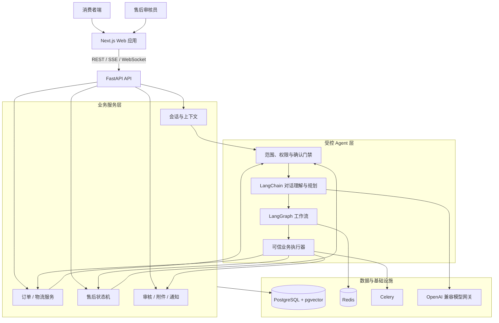
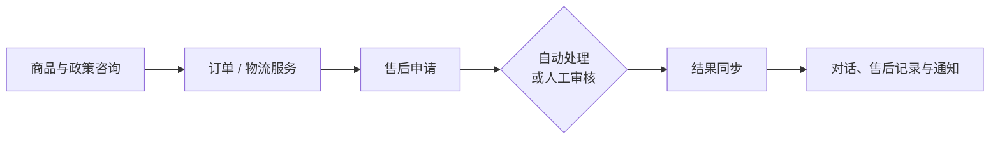

# 店小服 ShopCare｜智能电商客服与售后 Agent

> 一个面向电商售前咨询、订单服务与售后协同的全栈 AI Agent 项目。它把自然语言对话、可信业务执行、状态机和人工审核组织为可追溯的服务闭环，而不是让模型直接修改订单或处理退款。

     

## 这是什么

ShopCare 模拟电商平台中一条完整的客户服务链路：消费者可以咨询商品与平台规则、查询订单和物流、发起售后并补充凭证；审核员则在工作台查看订单、对话、附件、规则核验和历史记录后完成审核。

项目关注的核心问题是：**怎样让 Agent 既能理解自然语言，又不越权、不误操作，并在复杂售后场景中持续承接上下文。**

## 核心亮点

- **消费者与审核员双端体验**：覆盖商品推荐、政策咨询、订单/物流服务、售后申请、凭证补充、消息通知与人工审核。
- **受控 Agent 架构**：LangChain / LangGraph 负责对话理解、规划与上下文编排；订单归属、金额、状态和写操作由后端业务服务校验执行。
- **高风险操作门禁**：退款、取消订单、修改地址、物流拦截等请求遵循“解释 → 用户确认 → 业务执行”，并进行身份、订单归属与状态校验。
- **可恢复售后状态**：对话、售后记录、审核任务和通知使用统一后端状态同步；补材料、重新审核、刷新页面和重新登录后均可恢复进度。
- **产品化审核工作台**：集中展示用户信息、订单与商品、完整对话、凭证、风险核验、审核历史与操作日志，支持通过、拒绝、要求补充材料和审核说明。
- **可复现质量验证**：版本化离线评测覆盖商品、订单、物流、售后、越权访问、提示注入和确认保护；当前发布套件任务完成率 **98.48%**，关键操作安全率 **100%**。

## 能力地图

| 场景 | 用户能做什么 | 系统如何保障 |
| --- | --- | --- |
| 商品与政策咨询 | 商品推荐、规格/库存追问、七天无理由、退换货和运费规则咨询 | 目录与政策检索优先，避免将通用咨询误绑定到订单 |
| 订单与物流 | 查询订单、查看物流、催发货、催物流、物流异常和拦截申请 | 仅查询当前登录用户订单，关键动作需要确认 |
| 售后服务 | 退货退款、仅退款、换货、少件、错发、破损、凭证上传 | 状态机驱动，材料不足时引导补充，异常场景进入审核 |
| 人工审核 | 通过、拒绝、补材料、填写说明、回看完整上下文 | 审核结果同步回原对话、售后记录和未读通知 |
| 实时进度 | 售后阶段、审核结果和通知已读状态 | WebSocket 优先推送，轮询作为状态恢复保障 |

## 系统架构



### Agent 的执行原则

1. **先理解，再执行**：模型负责识别意图、补齐信息与组织答复，不直接写订单或退款数据。
2. **事实由服务确认**：订单、库存、金额、物流和售后状态均以业务服务返回的事实为准。
3. **关键操作二次确认**：涉及用户权益或订单变化时，先展示影响和下一步，收到明确确认后才执行。
4. **复杂问题可转人工**：高风险、证据冲突或用户主动要求人工时，保留完整上下文进入审核队列。

## 快速体验

### 运行环境

- Docker Engine 与 Docker Compose v2
- Node.js 20+
- 可用的 OpenAI 兼容模型网关（用于对话与 Embedding）

### 1. 配置环境变量

在项目根目录执行：

```bash
cp backend/.env.example backend/.env
cp web/.env.example web/.env.local
```

编辑 `backend/.env`，至少填写：

```dotenv
OPENAI_BASE_URL=https://your-openai-compatible-endpoint/v1
OPENAI_API_KEY=your-api-key
LLM_MODEL=your-chat-model
SECRET_KEY=replace-with-a-long-random-secret
```

`web/.env.local` 默认使用 `BACKEND_URL=http://localhost:18001`，本地运行时通常无需改动。

### 2. 启动后端与基础设施

```bash
docker compose up -d --build
docker compose exec app python scripts/seed_data.py
```

启动后可访问：

- API 健康检查：`http://localhost:18001/health`
- API 文档：`http://localhost:18001/docs`

### 3. 启动 Web 应用

新开一个终端：

```bash
cd web
npm ci
npm run dev
```

打开 `http://localhost:3000` 即可开始体验。

### 演示账号

| 角色 | 账号 | 密码 | 入口 |
| --- | --- | --- | --- |
| 消费者 | `10000001` | `123456` | `/login` |
| 售后审核员 | `80000001` | `123456` | `/admin/login` |

注册新用户后，系统会自动生成一组独立体验订单，便于完整体验商品、订单、物流和售后流程。

## 体验流程



1. 消费者在 `/chat` 发起商品、政策、订单或售后咨询。
2. 涉及具体订单时，系统完成订单匹配、状态核验与必要的确认。
3. 售后申请进入材料补充、自动处理或人工审核流程。
4. 审核结果与售后状态同步至原对话、售后记录和未读通知。

## 质量验证

项目提供独立 Docker 评测环境和版本化测试集，真实调用 HTTP/SSE 聊天链路，记录路由、状态快照、工具轨迹和人工复核队列。

```bash
docker compose -f docker-compose.eval.yml up --build -d
cd backend
python -m eval --suite release-v1 --output-dir eval/results
docker compose -f ../docker-compose.eval.yml down
```

当前发布套件覆盖商品、订单、物流、售后、确认保护、范围门禁、跨用户访问与提示注入。评测方法、指标定义和运行方式见 [Agent 离线评测说明](backend/eval/README.md)。

## 技术栈

- **前端**：Next.js 15、React 19、TypeScript、Tailwind CSS
- **后端**：FastAPI、SQLModel、Alembic、JWT、SSE、WebSocket
- **Agent**：LangChain、LangGraph、OpenAI 兼容模型接口、pgvector 检索
- **基础设施**：PostgreSQL、Redis Stack、Celery、Docker Compose
- **质量体系**：Pytest、隔离 Docker 评测环境、版本化回归 / 留出集 / 红队用例

## 文档导航

- [店小服 PRD（2025.09—2025.11）](店小服-AI电商客服与售后Agent-PRD.md)：新版产品基线，说明消费者与审核员双端流程、受控业务执行、售后状态机、安全边界、验收标准及已嵌入的界面示例。
- [产品需求文档（PRD）](docs/ShopCare_PRD_v1.0.md)：竞品调研、用户需求、功能规则与验收标准
- [项目总览](docs/PROJECT_OVERVIEW.md)：产品定位、核心流程、系统设计与评测结果
- [后端说明](backend/README.md)：服务模块与接口入口
- [Agent 离线评测](backend/eval/README.md)：测试集、指标与复现命令

## 受控演示说明

为保证可复现体验，仓库内的商品、订单、物流、库存和支付结果由隔离的演示数据与状态机驱动；系统不连接真实交易账户或支付渠道。模型密钥、上传凭证和运行日志均不会被提交到仓库。

---

欢迎 Star。
