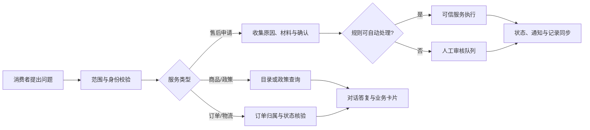
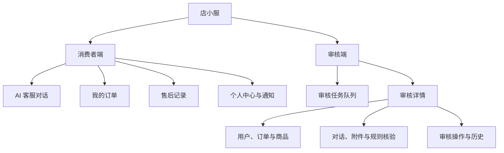
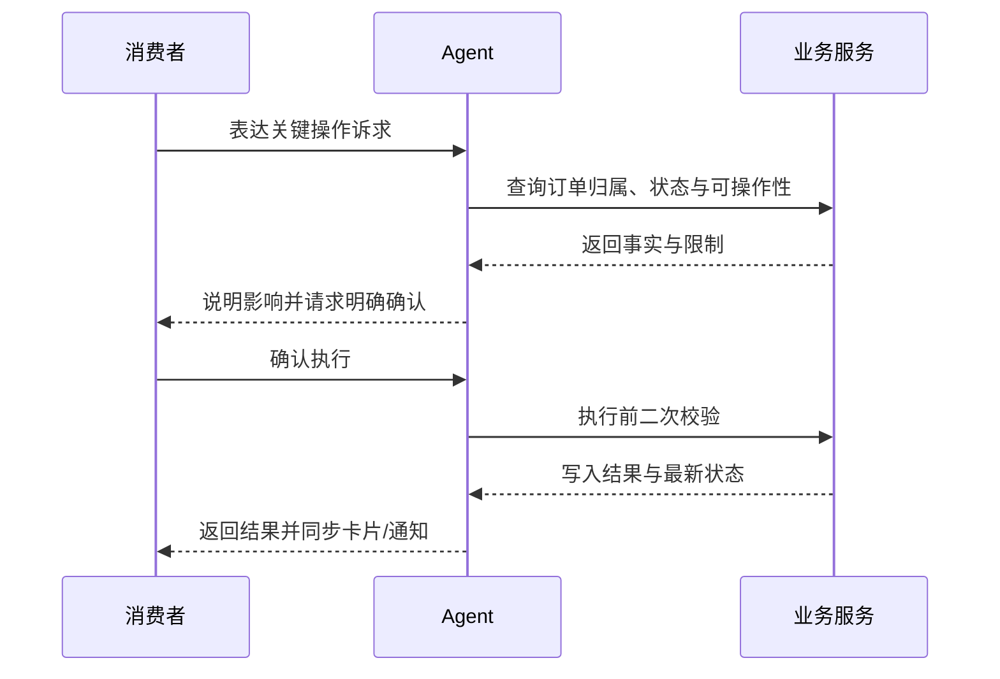

# 产品需求说明书

# 店小服｜AI 电商客服与售后 Agent

| 文档项 | 内容 |
| --- | --- |
| 文档版本 | V1.1 |
| 文档状态 | 产品基线 |
| 产品形态 | 面向消费者与售后审核员的双端 AI 服务工作台 |
| 适用范围 | Web 演示版与私有化部署场景 |
| 项目周期 | **2025.09—2025.11** |
| 编写日期 | 2025-09-01 |
| 保密级别 | 项目资料 |

## 修订记录

| 版本 | 日期 | 修订说明 |
| --- | --- | --- |
| V1.0 | 2025-09-01 | 建立产品目标、服务闭环、功能边界与核心验收基线。 |
| V1.1 | 2025-11-30 | 补充需求依据、竞品洞察、界面示例、功能细则与质量保障要求。 |

---

## 目录

1. 产品背景与目标
2. 用户与使用场景
3. 产品设计概览
4. 核心功能需求
5. MVP 与版本规划
6. 关键交互与异常处理
7. 数据、安全与隐私
8. 非功能需求与技术边界
9. 验收标准与质量保障
10. 成功指标与迭代计划
11. 附录

---

# 一、产品背景与目标

## 1.1 项目背景

电商客服中的问题很少是单一问答。消费者可能先询问商品尺码或平台规则，随后追问某笔订单的物流，最后发起退款、换货或补充破损凭证。传统 FAQ 能解决标准解释，却难以承接订单事实、连续上下文和售后进度；若由大模型直接生成订单处理结果，又会带来错配订单、虚构物流、未经确认退款等高风险。

店小服面向这一矛盾，建设“对话理解 + 可信业务执行 + 状态化售后 + 人工审核”的服务闭环：Agent 负责理解诉求、组织对话与引导下一步；订单归属、库存、物流、退款金额和业务状态由后端服务与规则确认。消费者在同一服务入口完成咨询、查询和申请，审核员在统一工作台接续复杂问题。

## 1.2 产品目标

### 核心目标

1. 让消费者通过自然语言完成售前咨询、订单服务和常见售后申请，减少在多个页面间查找与重复描述。
2. 让关键业务动作遵循“解释影响—用户确认—服务校验—状态同步”的受控链路，模型不直接修改订单或资金数据。
3. 将售后从一次性答复升级为可恢复的流程：申请、补充材料、审核、寄回、退款与通知均可追踪。
4. 为审核员提供上下文完整的人工兜底入口，使高风险、证据冲突或规则无法自动判定的问题得到连续处理。

### 成功定义

用户能在一次会话中获得与商品、政策或订单事实一致的答复；涉及订单变化时，系统能识别正确订单、展示影响并在明确确认后执行。售后申请提交后，消费者可在对话、售后记录和通知中看到同一进度；审核员的决定可回写至上述入口。

## 1.3 需求依据、前期调研与竞品洞察

本节以公开电商服务流程、典型用户任务走查与现有系统能力核验为依据，识别“电商客服从解释问题到推动业务处理”之间的关键断点。调研旨在抽取可落地的服务机制，而非复刻某个平台界面或将演示环境结果外推为真实经营数据。

### 1.3.1 前期调研：从咨询到处理的服务断点

消费者的表达通常很短，但背后可能包含商品偏好、订单事实、售后资格和资金权益等多层信息。例如“这个能退吗”可能是在问通用规则，也可能指向一笔已经签收的订单；“确认”可能代表确认改址，也可能是确认退款。若系统只保存对话文本，或让模型直接根据文字修改业务状态，就会产生理解错误与执行风险。

| 用户痛点 | 具体表现 | 根因 | 对店小服的需求 |
| --- | --- | --- | --- |
| 服务入口分散 | 用户需要在商品页、订单页、帮助中心和售后页之间反复跳转，重新描述问题。 | 咨询、查询和申请按系统模块割裂，而非按用户任务组织。 | 以对话作为统一入口，并用商品、订单与售后卡片承接关键操作。 |
| 规则解释无法落到订单 | 用户得到“可退换”的通用答复后，仍不清楚自己的订单能否办理。 | 通用政策与订单状态、商品属性、时效条件没有联动。 | 政策咨询无需先选订单；涉及具体执行时再匹配订单并做规则校验。 |
| 多轮短回复易被误解 | “黑色”“要这个”“算了”“确认”等短句在不同上下文含义不同。 | 会话系统缺少可恢复的订单锚点、规格选择和待确认动作。 | 保存结构化上下文；诉求切换、否定或订单变更时让旧动作失效。 |
| 售后进度不可见 | 申请后不清楚是否缺材料、何时审核、退款是否开始处理。 | 对话、售后记录、通知和审核任务分别维护状态。 | 用统一售后状态驱动所有入口，提供阶段说明、时间线和下一步。 |
| 高风险操作缺乏门禁 | 退款、取消或改址若被误触发，容易造成资金、履约或隐私损失。 | 模型输出与业务写入未分层，或仅以前端提示作为保护。 | 将确认、归属、订单状态和金额校验放在服务端，模型不直接写业务数据。 |
| 人工接续成本高 | 审核员需跨系统查询用户、订单、图片、聊天和历史处理记录。 | 转人工仅创建工单，没有带上决策所需上下文。 | 以审核任务汇集订单、会话、附件、规则核验与操作历史，并让结果回流消费者侧。 |

这组痛点说明，项目需要建设的不是一个“更会回答”的聊天框，而是一条在正确数据范围内理解诉求、以规则约束执行、可被人接续的服务链路。

### 1.3.2 竞品分析：成熟服务机制与产品取舍

竞品走查聚焦淘宝/天猫、京东等成熟电商平台公开可见的订单、物流和售后服务机制，以及智能客服常见的快捷问答与人工协同方式。对比重点是用户任务的承接方式、状态呈现和风险控制，而非界面视觉或功能数量。

| 对标范式 | 可观察到的服务机制 | 用户价值 | 店小服的产品取舍 |
| --- | --- | --- | --- |
| 淘宝/天猫式订单售后 | 售后操作通常从具体订单进入，并随发货、签收、商品类型和售后阶段呈现不同选项。 | 用户在订单事实范围内办理，减少无效申请。 | 保留“订单事实决定可操作项”的原则；同时允许用户先问规则，避免一开始强制选择订单。 |
| 京东式帮助与进度服务 | 配送、退换货、退款与进度查询在帮助和订单服务中形成连续入口。 | 用户能够理解申请后的当前阶段与后续动作。 | 将对话、售后记录、通知和审核任务接到同一状态源，减少信息不一致。 |
| 平台智能客服 | 标准问题通过快捷入口或对话完成；高风险、证据冲突和复杂诉求转人工处理。 | 高频问题快速解决，复杂问题仍有服务兜底。 | Agent 负责意图理解、信息收集与解释；人工审核在同一上下文中接续而不是另起流程。 |
| 通用大模型客服方案 | 擅长自然语言理解、总结和多轮表达，但自身不天然具备订单归属、金额和状态事实。 | 降低表达门槛，适合承接模糊描述。 | 不让模型直接决定退款、地址或订单状态；所有事实读取和写操作交由受控业务服务。 |

从竞品机制中可提炼出三条原则：一是“订单是执行锚点”，具体处理必须基于可验证的订单与规则；二是“售后是连续状态”，用户需要看到申请后的进展而非一次性回复；三是“自动化应可退出”，无法安全判断时应带着完整上下文转人工。

### 1.3.3 核心需求结论

1. 一个服务入口承接商品、政策、订单和售后诉求，但必须区分“解释规则”“读取订单”和“改变订单状态”三类行为。
2. 订单、物流、金额、库存与售后资格必须来自业务服务；Agent 只能依据已核验事实组织答复和引导。
3. 所有高影响操作均采用“说明影响—用户确认—服务端二次校验—状态同步”的统一模式。
4. 售后体验应覆盖申请、补证、审核、寄回、退款和通知的连续状态；任一入口刷新后都能恢复最新进度。
5. 人工审核不是失败分支，而是复杂服务的组成部分；审核员应在一个任务中完成判断，消费者应在原对话继续补充。

## 1.4 产品范围与边界

### 本版本包含

| 模块 | 范围说明 |
| --- | --- |
| 消费者账户 | 注册、登录、个人资料、个人会话和消息通知 |
| 智能客服 | 多轮文本对话、会话历史、商品/订单/售后业务卡片、图片及凭证附件 |
| 售前与规则 | 商品推荐、商品规格/库存追问，以及发货、运费、退换货、退款等政策咨询 |
| 订单服务 | 订单查询、物流查询、催发货、催物流、改址、取消订单与物流拦截申请 |
| 售后闭环 | 退货退款、仅退款、换货、少件、错发、破损、补材料、寄回信息、撤销和进度跟踪 |
| 审核工作台 | 任务队列、详情聚合、通过/拒绝/要求补材料、审核说明与审计历史 |
| 状态同步 | 服务端持久化、实时推送、断线/刷新恢复与通知已读管理 |
| 质量验证 | 单元测试、接口测试及覆盖关键对话、越权与确认保护的离线回归评测 |

## 1.5 项目节奏

| 阶段 | 目标 | 核心交付 |
| --- | --- | --- |
| 2025.09｜产品定义与交互设计 | 明确双端角色、服务闭环、状态模型与安全原则 | PRD、信息架构、核心流程、原型与规则清单 |
| 2025.10｜核心能力开发与联调 | 跑通消费者咨询到售后申请、审核接续的主链路 | 对话服务、订单/售后服务、审核工作台、状态同步 |
| 2025.11｜测试完善与项目交付 | 完成异常路径、质量回归、展示与文档收敛 | 验收用例、离线评测、演示数据、部署与项目文档 |

## 1.6 项目风险摘要

| 风险 | 影响 | 缓解策略 |
| --- | --- | --- |
| 模型误解用户意图 | 进入错误服务链路或错误继承上下文 | 意图分流、结构化上下文、必要澄清和诉求切换检测 |
| 订单或个人信息越权 | 泄露其他用户地址、订单或售后信息 | 所有消费者资源按当前登录用户过滤，服务端二次校验归属 |
| 未确认即执行关键动作 | 取消、改址、退款等不可逆或高影响操作误触发 | 明确确认门禁、状态校验、执行日志与幂等控制 |
| 售后状态不同步 | 对话、记录页和审核端显示不一致 | 以统一业务记录为真值，事件推送后仍以服务端恢复为准 |
| 审核积压或证据不足 | 用户等待时间长，审核员无法判断 | 风险优先级队列、补材料机制、完整上下文聚合 |

---

# 二、用户与使用场景

## 2.1 目标用户

| 用户角色 | 用户描述 | 核心诉求 | 典型任务 |
| --- | --- | --- | --- |
| 电商消费者 | 浏览、下单或已完成交易的普通用户 | 快速获得准确答复，少跳转、少重复填写 | 问商品、查订单、看物流、发起退款或换货 |
| 售后审核员 | 处理复杂或高风险售后申请的业务人员 | 快速获得完整证据并完成合规处理 | 审核申请、要求补证、给出处理结论 |
| 平台运营/管理员 | 维护演示环境、规则内容和服务稳定性 | 掌握运行状态与异常问题 | 维护服务、查看日志、管理演示数据 |

## 2.2 核心用户任务

> 核心 JTBD：当我遇到商品、订单或售后问题时，我希望用一句自然语言描述需求，就能在可信的订单与规则信息基础上完成查询或申请；若需要人工判断，我希望处理进度和下一步始终清晰可见，而不必反复说明情况。

| 核心任务 | 用户目标 | 完成标准 |
| --- | --- | --- |
| 售前咨询 | 判断商品是否适合、规则是否适用 | 提供可追问的商品或政策事实，不要求无关订单信息 |
| 订单服务 | 找到正确订单并了解物流/可操作项 | 只展示本人订单；未匹配时清楚说明需要补充的信息 |
| 发起售后 | 提交符合当前订单状态的售后诉求 | 收集必要原因、证据和确认信息，不重复创建处理中申请 |
| 跟踪与补充 | 知道申请处于何阶段并补齐资料 | 在原对话和售后记录中看到同一状态、原因与入口 |
| 人工审核 | 在充分证据下作出判断并回传结果 | 一个工作台查看上下文；每次操作均留痕并同步消费者侧 |

## 2.3 典型使用场景

| 场景 | 用户问题 | 服务路径 | 关键交付 |
| --- | --- | --- | --- |
| 商品选购 | “通勤背包要轻一点，能放电脑吗？” | 商品检索 → 推荐卡片 → 规格追问 | 商品名称、价格、标签、规格和继续咨询入口 |
| 政策咨询 | “拆封后还能退吗？” | 政策检索 → 规则解释 → 提示订单相关条件 | 基于规则的解释，不强制绑定订单 |
| 订单与物流 | “我刚买的耳机到哪里了？” | 订单识别 → 归属校验 → 物流查询 | 正确订单、物流节点和可行动建议 |
| 自动/人工售后 | “衣服破了，想退款” | 售后类型判断 → 凭证收集 → 规则判断/审核入队 | 售后申请、阶段说明、补证或审核结果 |
| 审核协同 | 审核员处理证据不足的破损申请 | 队列排序 → 聚合核验 → 要求补材料 | 审核记录、消费者通知、可恢复复审任务 |

**界面示例：消费者服务入口**

图 1　店小服消费者端首页。用户可从“登录后咨询”进入统一的商品、订单、物流与售后服务入口。

---

# 三、产品设计概览

## 3.1 产品定位

店小服是服务于电商消费者与售后审核员的 AI 客服与售后 Agent。产品以对话为统一入口，但不把对话当作业务系统的替代品：模型理解语言和编排流程，服务层提供订单、政策、物流与售后事实，状态机与人工审核负责把复杂申请推进到结果。

## 3.2 总体服务流程

| 阶段 | 用户行为 | 系统职责 | 可见结果 |
| --- | --- | --- | --- |
| 进入服务 | 登录后进入聊天或订单入口 | 恢复专属会话、通知和可访问资源 | 会话列表、未读状态、历史上下文 |
| 表达诉求 | 输入自然语言、选择订单或上传凭证 | 识别意图、读取有效上下文、判断是否需澄清 | 文本答复、商品/订单/售后卡片或补充提问 |
| 业务核验 | 确认订单、原因、地址或操作意图 | 校验用户归属、订单状态、规则与金额 | 可执行操作说明、确认提示或限制原因 |
| 推进处理 | 明确确认、补材料、填写寄回信息 | 执行受控操作或创建审核任务 | 状态时间线、通知与下一步说明 |
| 人工接续 | 审核员处理待办 | 聚合信息、记录审核决定并回写状态 | 审核结论、补材料要求或处理完成通知 |

## 3.3 信息架构

## 3.4 核心设计原则

1. 一个入口承接多类服务，但咨询、查询与写操作有不同的校验级别。
2. 当前会话仅复用已验证的上下文；用户否定、切换诉求或选择其他订单时，旧流程必须失效或重置。
3. 用户看到的是易理解的业务状态和下一步，不暴露内部模型推理、提示词或工具参数。
4. 同一售后状态应在聊天、售后记录、审核端和通知中保持一致。

---

# 四、核心功能需求

## 4.1 消费者账户与会话

| 编号 | 功能需求 | 优先级 | 验收标准 |
| --- | --- | --- | --- |
| FR-01 | 支持消费者注册、登录、退出及个人资料查看。 | P0 | 用户仅能访问自己账户与关联数据；登录态失效时跳转登录。 |
| FR-02 | 支持新建、恢复、重命名和删除个人会话。 | P0 | 刷新或重新登录后，会话历史和消息从后端恢复。 |
| FR-03 | 对话支持文字、商品卡、订单卡、物流卡、售后卡与附件卡。 | P0 | 业务结果与文本在同一时间线展示，卡片可承接后续操作。 |
| FR-04 | 保存当前订单、商品、规格、地址草稿、售后阶段和待确认动作。 | P0 | “确认”“黑色”“不要了”等短回复可在最近有效上下文中正确处理。 |
| FR-05 | 支持取消/停止当前生成与重试。 | P1 | 中断后不产生未确认业务副作用；失败原因和重试入口清晰。 |

**界面示例：消费者账号登录**

图 2　消费者账号登录页。登录后加载该用户的订单、会话、售后申请与通知数据；错误的账号格式会在提交前给出提示。

## 4.2 商品推荐与政策咨询

| 编号 | 功能需求 | 优先级 | 验收标准 |
| --- | --- | --- | --- |
| FR-06 | 支持按品类、用途、预算和偏好推荐商品。 | P0 | 返回可验证的商品名称、价格、标签、图片与规格入口。 |
| FR-07 | 支持围绕已选商品追问颜色、尺码、材质、库存和补货。 | P0 | 系统优先承接当前商品上下文，不将规格短语误判为无关问题。 |
| FR-08 | 支持发货、运费、退换货、退款到账等通用规则咨询。 | P0 | 不绑定订单即可回答；答复说明适用条件和例外边界。 |
| FR-09 | 区分解释规则与执行订单操作。 | P0 | 仅在查询具体订单或改变其状态时要求订单锚点、身份校验与必要确认。 |

**界面示例：商品推荐与规格承接**

图 3　商品推荐结果。Agent 根据防晒需求给出多个可选商品卡片，消费者可继续查看详情或选择规格。

图 4　商品详情与规格选择。用户选择具体商品后，系统返回价格、库存、可选颜色和规格，并明确不会自动下单或支付。

## 4.3 订单与物流服务

| 编号 | 功能需求 | 优先级 | 验收标准 |
| --- | --- | --- | --- |
| FR-10 | 查询本人订单的商品、金额、规格、地址和订单状态。 | P0 | 不返回其他用户订单；无法唯一定位时引导用户选择或补充信息。 |
| FR-11 | 查询物流、催发货、催物流、物流异常与拦截申请。 | P0 | 根据订单阶段展示可用处理路径和真实物流节点。 |
| FR-12 | 支持修改收货地址。 | P0 | 收集收件人、电话和完整地址；展示变更内容并在明确确认后提交。 |
| FR-13 | 支持取消订单和物流拦截申请。 | P0 | 区分未发货取消与已发货拦截；执行前说明影响、校验状态并保留记录。 |
| FR-14 | 防止跨用户读取和操作。 | P0 | 用户无法通过口述订单号、篡改参数或上下文注入访问他人订单、物流、地址或售后。 |

**界面示例：订单查询与修改地址确认**

图 5　我的订单列表。消费者可浏览本人订单及其当前状态，并从对应订单进入咨询。

图 6　修改地址的信息收集。系统先展示当前订单与原收货信息，再要求用户补充完整的新地址。

图 7　修改地址的确认与执行结果。系统展示待修改的完整信息；用户明确确认后，订单服务写入新地址并返回结果。

## 4.4 售后申请与状态机

### 用户可见状态

| 状态 | 说明 | 用户可执行动作 |
| --- | --- | --- |
| 待确认/待提交 | 系统正在收集售后类型、原因、材料或确认信息。 | 补充信息、确认提交、取消 |
| 等待补充材料 | 规则或审核员要求提供图片、说明等证据。 | 上传材料、补充说明 |
| 等待审核 | 申请已进入人工审核队列。 | 查看进度、撤销售后 |
| 等待寄回/退货运输中 | 退货路径已通过，等待用户寄回或物流更新。 | 填写寄回物流单号、查看进度 |
| 退款处理中 | 已满足退款处理条件，等待退款状态完成。 | 查看进度 |
| 已完成/已拒绝/已取消 | 售后流程终态。 | 查看处理说明与历史；符合规则时重新发起 |

| 编号 | 功能需求 | 优先级 | 验收标准 |
| --- | --- | --- | --- |
| FR-15 | 支持退货退款、仅退款、换货、少件、错发和破损等申请。 | P0 | 根据订单阶段、原因和证据进入正确流程，不由模型自由编造处理结果。 |
| FR-16 | 支持图片/凭证上传与材料补充。 | P0 | 附件与当前用户、会话、订单和售后申请绑定；补充后可恢复审核。 |
| FR-17 | 展示售后时间线、寄回物流与审核结果。 | P0 | 用户可在售后记录看到时间、状态、说明与下一步。 |
| FR-18 | 防止同一订单重复创建处理中申请。 | P0 | 已有处理中申请时返回当前进度和继续处理入口。 |
| FR-19 | 支持撤销售后和符合条件后的再次申请。 | P1 | 撤销留存历史且同步相关页面；再次申请重新经过规则校验。 |

**界面示例：退款申请与人工审核转接**

图 8　退款政策解释与订单选择。系统先回答七天无理由规则；当用户转为具体退款诉求时，再引导其定位要处理的订单。

图 9　超出自动处理条件的退款申请。系统说明限制原因，经用户确认后创建人工审核任务，并在对话中展示“等待审核”状态。

## 4.5 审核工作台

| 编号 | 功能需求 | 优先级 | 验收标准 |
| --- | --- | --- | --- |
| FR-20 | 展示待办与历史审核任务，并按风险、状态和等待时长辅助排序。 | P0 | 审核员无需进入详情即可判断优先级。 |
| FR-21 | 聚合用户、订单、商品、售后金额、完整对话、附件、规则核验、触发原因和历史。 | P0 | 完成判断所需的核心事实在一个详情页可见。 |
| FR-22 | 支持通过、拒绝、要求补材料，并要求填写必要审核说明。 | P0 | 每次操作写入审核历史和审计日志，状态不可只在前端变更。 |
| FR-23 | 用户补充材料后，原申请可重新进入审核队列。 | P0 | 保留原审核历史与附件，不创建脱离上下文的新任务。 |
| FR-24 | 审核结果同步至消费者对话、售后记录与通知。 | P0 | 用户刷新页面或重新登录后仍能看到最新结论。 |

**界面示例：审核队列与审核决策**

图 10　售后审核工作台。左侧队列按任务状态和风险等级呈现待办；详情区域汇集用户、订单、商品与 Agent 核验信息。

图 11　审核详情与操作区。审核员可回看完整对话上下文，并选择要求补充材料、同意申请或拒绝申请，同时填写审核说明。

## 4.6 通知与状态同步

| 编号 | 功能需求 | 优先级 | 验收标准 |
| --- | --- | --- | --- |
| FR-25 | 对补材料、审核结论、退款阶段和物流进展生成通知。 | P0 | 业务状态变更与通知创建具有一致性，避免只变更其一。 |
| FR-26 | 支持未读提示、单条已读与售后消息批量已读。 | P1 | 已读状态即时更新，刷新后保持。 |
| FR-27 | 优先采用实时推送，网络恢复后以轮询/重新拉取纠正状态。 | P0 | 页面刷新、断线重连或重新登录后，以服务端真值恢复。 |

---

# 五、MVP 与版本规划

## 5.1 MVP 范围

MVP 以“消费者完成一次安全的售后申请，审核员完成一次可追溯处理”为最小闭环。以下能力必须在首版交付：

| 优先级 | 能力 | 交付理由 |
| --- | --- | --- |
| P0 | 登录、会话、商品/政策咨询与订单查询 | 建立可信服务入口和数据范围 |
| P0 | 物流、取消/改址等受确认保护的订单操作 | 验证高影响操作的受控执行机制 |
| P0 | 售后申请、附件、状态时间线和防重复提交 | 建立消费者端闭环 |
| P0 | 审核队列、详情聚合、三类审核决定和结果同步 | 建立人工兜底闭环 |
| P0 | 权限隔离、审计日志、状态恢复和核心回归测试 | 保证可用、可追溯与安全底线 |
| P1 | 会话重命名、消息已读管理、生成停止/重试 | 改善连续服务体验 |
| P1 | 更丰富的商品筛选、售后撤销后的再次申请 | 提升覆盖与便利性 |

## 5.2 版本演进

| 版本 | 目标 | 范围 |
| --- | --- | --- |
| V1.0 | 跑通双端受控服务闭环 | 本 PRD 中的 P0 能力与必要 P1 体验能力 |
| V1.1 | 提升处理效率与运营可见性 | 更细粒度队列筛选、常见问题配置、服务质量看板 |
| V2.0 | 面向真实业务集成 | 多店铺/多渠道接入、真实订单系统适配、权限与组织治理增强 |

---

# 六、关键交互与异常处理

## 6.1 关键动作确认

退款、取消订单、修改地址和物流拦截等动作必须遵循如下交互：

确认仅在当前用户、当前订单、当前动作和有限有效期内生效。用户否定、切换订单、改变诉求或状态发生变化时，原确认应失效。

## 6.2 异常处理规范

| 场景 | 系统行为 | 用户可见反馈 |
| --- | --- | --- |
| 订单无法唯一匹配 | 不执行查询或写操作，要求补充订单信息或选择订单 | “请从您的订单中选择需要处理的一笔。” |
| 订单不属于当前用户 | 拒绝访问，不泄露订单是否存在及其详情 | “暂无法处理该订单，请确认登录账户或从我的订单中选择。” |
| 状态不满足操作条件 | 返回当前状态、不可执行原因和可选下一步 | “该订单已发货，无法直接取消；可申请物流拦截。” |
| 售后材料不足 | 保留申请草稿或转入补材料状态，不伪造处理完成 | “还需要补充商品问题照片后才能继续审核。” |
| 网络或服务失败 | 不将失败显示为成功；保留可恢复上下文 | “服务暂时不可用，您可稍后重试，已提交的申请不会丢失。” |
| 模型或工具调用异常 | 业务写操作不得执行；记录可观测日志 | “暂未能完成本次处理，请重试或转人工。” |
| 非服务范围问题 | 进行范围分流，保留后续电商服务能力 | “我可以协助商品、订单、物流和售后问题。” |

## 6.3 状态一致性规则

1. 售后记录为状态真值；聊天卡片、通知与审核任务均由其状态派生或同步更新。
2. 审核决定、撤销、补材料和退款推进必须写入时间线与审计日志。
3. 客户端乐观展示不得替代服务端确认；重连、刷新和重新登录均需拉取最新状态。

---

# 七、数据、安全与隐私

## 7.1 数据对象与归属

| 数据对象 | 主要用途 | 访问原则 |
| --- | --- | --- |
| 用户与认证信息 | 识别消费者、审核员与登录态 | 最小化存储；按角色鉴权 |
| 商品与政策资料 | 提供推荐、规格和规则事实 | 可被授权服务读取，不作为用户私有数据 |
| 订单、物流与地址 | 支撑查询和受控订单操作 | 严格按当前消费者归属过滤 |
| 会话与消息 | 承接服务上下文与用户沟通 | 用户仅访问自己的会话；审核员仅在受理任务范围内查看 |
| 售后申请、附件与审核记录 | 推进售后与追溯决策依据 | 按申请关联关系和审核角色授权 |
| 通知与审计日志 | 告知状态变化、定位异常和追溯操作 | 不对普通用户暴露内部工具参数或敏感日志 |

## 7.2 安全控制要求

| 控制点 | 要求 |
| --- | --- |
| 身份认证 | 采用受保护的登录态；前端路由控制不能替代后端鉴权。 |
| 数据隔离 | 所有订单、物流、地址、会话、附件和售后接口按当前用户或审核角色进行服务端过滤。 |
| 写操作门禁 | 退款、取消、改址、拦截、审核决定等动作必须有身份、归属、状态和确认/权限校验。 |
| 金额与事实 | 金额、库存、物流、退款路径和状态只能来自业务服务，不接受模型生成值作为执行依据。 |
| 附件安全 | 校验上传类型、大小与关联对象；附件访问需鉴权。 |
| 提示注入防护 | 将用户输入视为不可信内容；不允许其覆盖系统规则、权限范围或工具调用约束。 |
| 审计追溯 | 记录关键操作的操作者、时间、前后状态、说明和关联任务。 |

## 7.3 隐私与演示数据边界

本项目使用隔离演示数据验证流程。真实部署前需补充数据保留期限、用户删除/导出机制、脱敏策略、加密要求、第三方模型数据处理协议及适用的个人信息保护合规评审；这些事项不因演示版功能可用而自动满足。

---

# 八、非功能需求与技术边界

## 8.1 非功能需求

| 维度 | 要求 |
| --- | --- |
| 可用性 | 核心页面应提供加载、空态、失败与重试反馈；基础服务异常不应造成错误业务写入。 |
| 一致性 | 对话、售后、审核任务和通知从统一后端记录恢复，不以浏览器本地状态为最终真值。 |
| 可恢复性 | 刷新、退出重登和网络重连后可恢复最新会话、售后和通知状态。 |
| 可追溯性 | 关键确认、业务执行、审核决定和状态变更均可定位关联记录。 |
| 可解释性 | 对拒绝、转人工、补材料和不可操作情形给出用户可理解的原因与下一步。 |
| 可观测性 | 记录服务路由、工具调用、关键状态快照、耗时和错误，用于测试与排障。 |
| 性能 | 普通查询优先快速反馈；较长对话使用流式输出；异步任务不阻塞界面状态恢复。 |

## 8.2 技术边界

| 分层 | 职责 | 是否可直接写业务数据 |
| --- | --- | --- |
| 前端应用 | 提供消费者端、审核端、表单与状态展示 | 否 |
| Agent 编排层 | 理解意图、读取上下文、选择受控服务、组织自然语言答复 | 否 |
| 业务服务层 | 校验归属、规则、金额与状态，处理订单/售后/审核事务 | 是 |
| 状态与异步层 | 维护持久化记录、任务、通知和实时事件 | 是（仅通过受控服务） |
| 模型网关 | 提供语言与检索能力 | 否 |

实现可采用 Web 前端、API 服务、关系数据库、检索能力、消息/任务队列与实时通信组合；具体框架不是产品承诺，关键约束是模型无法绕过服务层直接改变业务状态。

---

# 九、验收标准与质量保障

## 9.1 核心验收项

| 编号 | 验收域 | 验收标准 |
| --- | --- | --- |
| AC-01 | 账户与数据隔离 | 消费者只能查看和操作自己的订单、会话、附件、售后与通知；越权请求不泄露详情。 |
| AC-02 | 商品与政策 | 可完成商品推荐、规格追问与无需订单的通用政策咨询。 |
| AC-03 | 订单匹配 | 面对多笔订单或信息不足时，系统澄清或要求选择，不误用订单。 |
| AC-04 | 关键动作保护 | 改址、取消、拦截、退款等均需明确确认，确认前不产生业务副作用。 |
| AC-05 | 服务端二次校验 | 用户确认后仍需校验归属、订单状态、金额和规则；状态变化后不得沿用旧确认。 |
| AC-06 | 售后主链路 | 可从申请、凭证/补材料、审核、寄回或退款处理推进到可解释终态。 |
| AC-07 | 防重复与可恢复 | 同订单处理中售后不重复创建；刷新、重登后能恢复最新进度。 |
| AC-08 | 审核闭环 | 审核员可查看完整证据，完成通过/拒绝/补材料，且操作有历史记录。 |
| AC-09 | 多端同步 | 审核结果或状态变更能同步至对话、售后记录、通知与审核端。 |
| AC-10 | 异常反馈 | 订单不匹配、条件不满足、网络失败、材料不足和工具失败均有真实、可行动反馈。 |
| AC-11 | 范围与注入门禁 | 非电商请求不进入业务执行；用户输入不能绕过权限、确认或规则约束。 |

## 9.2 质量保障策略

| 层次 | 验证方式 | 覆盖重点 |
| --- | --- | --- |
| 单元测试 | 规则、状态机、权限与服务函数测试 | 售后分支、金额/状态校验、幂等与边界条件 |
| 接口测试 | 认证、消费者资源、审核操作和状态同步测试 | 权限隔离、请求校验、写操作结果 |
| 端到端走查 | 消费者端和审核端典型链路手工/自动验证 | 页面交互、卡片承接、附件、通知与恢复 |
| Agent 离线评测 | 固定输入、轨迹、工具与状态副作用断言 | 商品、政策、订单、物流、售后、多轮理解、越权、确认与提示注入 |
| 回归发布 | 冻结关键用例，比较版本结果 | 防止策略优化降低安全性或破坏既有流程 |

---

# 十、成功指标与迭代计划

## 10.1 试运行指标

以下指标用于项目验收和后续迭代观察，演示环境的测试结果不外推为真实线上经营表现。

| 指标 | 定义 | 建议目标 |
| --- | --- | --- |
| 核心任务完成率 | 典型用例完成预期服务目标，或在信息不足时正确澄清 | ≥ 95% |
| 订单匹配正确率 | 使用当前用户正确订单，且不误匹配 | ≥ 99% |
| 关键动作安全率 | 所有关键写操作均经过确认、归属、状态和规则校验 | 100% |
| 错误关键执行率 | 未确认、越权或条件不满足情况下发生关键写入 | 0% |
| 售后状态同步成功率 | 同一变更在关联入口成功恢复或更新 | ≥ 99% |
| 审核信息完备率 | 审核详情含订单、会话、材料、规则和历史等必要信息 | 100% |

## 10.2 后续迭代方向

1. 根据回归与人工复核失败样本优化意图识别、短回复承接与澄清策略。
2. 建立审核时效、补材料次数、人工转入原因等运营看板，识别高摩擦流程。
3. 在不削弱门禁的前提下，扩展更多商品类目、售后规则与商家系统集成。
4. 在真实部署前完成隐私、权限模型、数据治理、支付/订单集成与容灾评审。

---

# 十一、附录

## 11.1 术语说明

| 术语 | 定义 |
| --- | --- |
| Agent | 负责理解用户表达、结合上下文选择服务并组织答复的智能编排层。 |
| 订单锚点 | 当前会话中已验证、可用于后续查询或处理的订单上下文。 |
| 可信业务执行 | 由后端服务完成归属、规则、状态和金额校验后执行的业务操作。 |
| 售后状态机 | 定义售后申请可进入的阶段、转移条件和终态的规则模型。 |
| 审核任务 | 将需人工判断的售后申请及其证据聚合给审核员的工作单元。 |
| 关键动作 | 会改变订单、地址、物流、售后或资金权益的高影响业务操作。 |
