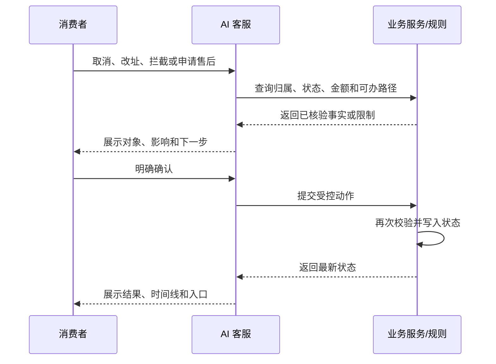
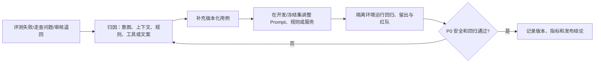

# 店小服 ShopCare｜智能电商客服 PRD

| 文档项 | 内容 |
| --- | --- |
| 版本 | V3.0 |
| 阶段 | 0→1 MVP |
| 产品形态 | 消费者智能客服 + 售后审核工作台 |
| 更新日期 | 2026-07-21 |

## 目录

1. 产品定义与边界
2. 桌面研究与问题洞察
3. 用户、场景与关键决策
4. MVP 范围与优先级
5. 流程、状态与职责边界
6. 核心功能需求与验收
7. 异常、安全与隐私
8. 指标、AI 评测与迭代
9. 数据、运营与非功能要求
10. 附录

---

# 1. 产品定义与边界

## 1.1 一句话定位

店小服是面向电商消费者的智能客服。消费者可用对话完成商品与规则咨询、订单与物流查询、售后申请和进度跟进；系统以订单事实、规则和确认机制约束写操作，复杂申请由审核工作台接续。

## 1.2 目标用户与价值主张

| 用户 | 核心任务 | 主要问题 | 价值 |
| --- | --- | --- | --- |
| 消费者 | 问商品/规则、查订单物流、办理售后、补凭证、看进度 | 入口分散、重复描述、不清楚下一步 | 用自然语言进入服务，在一个上下文中完成查询、申请和跟进。 |
| 售后审核员 | 处理复杂或高风险售后 | 订单、对话、附件和历史信息分散 | 在一个任务中查看完整事实与证据，并把决定同步给消费者。 |
| 客服/运营负责人 | 优化规则与服务质量 | 难以定位意图、流程和安全问题 | 通过审核记录、状态数据和离线评测持续迭代。 |

**价值主张：** AI 负责理解、追问和解释；业务服务负责订单、金额、规则和状态；人工负责复杂判断。消费者少跳转、少重复，业务侧可控、可追溯。

## 1.3 产品目标

1. 让消费者在一个连续入口完成商品/规则咨询、订单服务和售后主链路。
2. 让订单归属、金额、物流和售后状态由业务服务提供，不由模型生成。
3. 让取消订单、修改地址、物流拦截和售后提交遵循“说明影响 → 明确确认 → 二次校验 → 状态同步”。
4. 让售后从申请、补材料、审核到寄回和退款进度形成可恢复的时间线。
5. 让审核员无需跨页面拼接信息即可完成通过、拒绝或补材料决定。

## 1.4 非目标

- 不提供下单、支付、营销、商家经营、多商家结算或复杂工单分派。
- 不将模型输出作为退款金额、订单状态、物流事实或审核结论。
- 不连接真实支付、银行到账、物流或商家 ERP；作品集体验使用隔离订单和演示状态机。
- 不以自动化替代人工裁决：证据不足、商品问题、高风险和规则冲突的申请由审核员处理。
- 不把内部推理日志、旧 LangGraph/退款工具实验代码或未接入能力作为消费者功能。

## 1.5 产品设计原则

1. **先分层，再办理：** 通用规则可直接咨询；具体查询与写操作必须绑定本人订单。
2. **事实与表达分离：** 模型只能决定如何理解和表达，不能决定修改哪笔订单或退款金额。
3. **确认必须有对象：** 确认绑定当前用户、订单、动作和上下文；换订单或换诉求后重新确认。
4. **一笔售后一条时间线：** 对话、售后记录、审核任务和通知读取同一申请状态。
5. **自动化可退出：** 不能安全判断时，说明限制、要求材料或进入人工审核，不虚构成功结果。
6. **演示数据如实呈现：** 演示状态用于展示链路，不代表真实支付、物流或商家处理结果。

---

# 2. 桌面研究与问题洞察

本 PRD 以公开资料、竞品可见服务机制与项目实际可操作路径为依据，不使用虚构访谈、客户数量、满意度或上线成果。

| 公开材料/观察 | 可用信息 | 产品启示 |
| --- | --- | --- |
| [Olist Brazilian E-Commerce Public Dataset](https://www.kaggle.com/datasets/olistbr/brazilian-ecommerce) | 订单、订单项、支付、评价与物流时间的关联结构 | 售后判断需要订单对象、金额、履约节点和历史沟通，不能只依据一句用户描述。 |
| [UCI Online Retail Dataset](https://archive.ics.uci.edu/dataset/352/online+retail) | 商品、数量、单价、客户与取消记录 | 售后需要落到订单与商品信息，避免模糊表达直接触发写入。 |
| [《中华人民共和国消费者权益保护法》](https://www.gov.cn/guoqing/2021-10/29/content_5647635.htm) | 消费者权益与经营者责任的公开框架 | 规则答复需说明适用条件、例外与办理路径；办理时还要核验具体订单。 |
| 淘宝/天猫、京东等公开订单与售后入口 | 从订单进入售后、查看物流和处理阶段的机制 | 订单是执行锚点，状态是用户预期，复杂情形需要可追踪地转人工。 |

| 用户问题 | 常见表现 | 产品回应 |
| --- | --- | --- |
| 诉求短、对象不清 | “我要退”“这个有问题”“催一下” | 识别意图后选择订单或补充信息；信息不足时不创建申请。 |
| 规则与资格脱节 | 知道规则却不知道自己的订单能否办 | 先解释通用规则，再按订单事实核验可办路径。 |
| 短回复易误触发 | “确认”“算了”“换一个”指向不明 | 保存订单锚点与待确认动作，切换对象或诉求后让旧动作失效。 |
| 提交后没有连续反馈 | 不知道是否缺材料、是否审核、退款进度 | 用售后记录、时间线、对话状态卡与通知同步展示。 |
| 人工接续成本高 | 审核员要反复查订单、聊天和图片 | 将订单、附件、会话、规则检查和历史聚合进一个审核任务。 |

---

# 3. 用户、场景与关键决策

## 3.1 核心场景

| 场景 | 用户目标 | 服务路径 | 输出 |
| --- | --- | --- | --- |
| 商品推荐与追问 | 找到适合场景、预算或规格的商品 | 描述需求 → 商品卡 → 详情/规格/库存追问 | 商品、价格、卖点、颜色、尺码与库存说明；不创建订单。 |
| 规则咨询 | 了解退货、仅退款、运费、价保或拦截规则 | 提问 → 规则解释 → 需要办理时选订单 | 条件、例外与下一步；不改变订单。 |
| 订单与物流 | 查询本人订单、物流或发货进度 | 绑定订单 → 查询事实 → 选择下一步 | 订单状态、物流单号或催发货/异常处理建议。 |
| 未发货取消/退款 | 取消未发货订单 | 选择订单 → 展示金额和影响 → 确认 | 创建售后记录，订单进入退款处理中。 |
| 已签收售后 | 退货退款、仅退款或换货 | 选择订单 → 原因/凭证 → 确认 → 自动推进或审核 | 申请编号、是否寄回/补材料/等待审核和后续状态。 |
| 商品问题/少件 | 提交可核验的问题 | 描述问题 → 上传图片凭证 → 确认 | 进入人工核实或补材料路径。 |
| 售后跟进 | 补凭证、填退货单号、查看审核结果 | 售后记录/原对话 → 执行当前允许动作 | 时间线与状态同步更新。 |
| 人工审核 | 对复杂申请做决定 | 队列 → 查看事实/证据 → 填说明并决策 | 决定同步到消费者对话、售后记录与通知。 |

## 3.2 关键产品决策

| 决策 | 取舍 | 原因 |
| --- | --- | --- |
| 对话是统一入口，但不能直接写数据 | 降低表达门槛，同时保留受控服务 | 将理解正确与执行正确分开。 |
| 规则问题不强制选订单 | 少一步阻塞 | 用户先判断规则，再进入具体办理。 |
| 高影响动作二次确认 | 多一步交互换取安全性 | 取消、改址、拦截和售后提交均会影响权益或履约。 |
| 商品问题先收集图片 | 不用模型猜测质量或缺件 | 证据是人工审核与处理说明的共同基础。 |
| 状态以售后记录为核心 | 聊天文本不是状态源 | 支持刷新、重登和审核结果回写。 |

## 3.3 实际用户路径与截图

**路径 A：登录 → 商品咨询 → 规格追问**

图 1　消费者使用 8 位账号登录；注册后获得独立体验订单。

图 2　对话返回商品卡片，消费者可查看详情或选择规格。

图 3　展示价格、颜色、尺码与库存说明；该路径不包含下单和支付。

**路径 B：订单 → 受控改址**

图 4　消费者从自己的订单进入咨询。

图 5　系统收集收件人、联系电话和详细地址，资料不完整时不提交。

图 6　展示拟修改内容，消费者确认后才更新订单地址。

**路径 C：规则咨询 → 售后申请 → 审核**

图 7　先回答规则，办理具体售后时再绑定订单。

图 8　需要人工核实的申请在确认后进入审核。

图 9　审核队列与聚合任务详情。

图 10　审核员查看对话和附件后，通过、拒绝或要求补材料。

以上图片均已由 Git 跟踪；Markdown 相对路径以尖括号包裹含空格文件名，GitHub 可正常显示。

---

# 4. MVP 范围与优先级

**MVP 闭环：** 消费者绑定本人订单，在对话中完成咨询或提出售后；系统收集信息、确认并创建申请；申请自动推进或进入审核；进度与结论回到原对话和售后记录。

| 优先级 | 能力 | 范围 |
| --- | --- | --- |
| P0 | 身份、订单隔离与会话 | 只读写本人订单、会话和售后；对象不明时澄清。 |
| P0 | 商品推荐、详情/规格/库存与规则答复 | 演示商品目录与政策解释；不产生交易。 |
| P0 | 订单/物流、催发货、取消、改址、拦截 | 高影响操作均先确认并由服务端校验。 |
| P0 | 退货退款、仅退款、换货、破损/少件 | 收集原因与图片，防止重复创建处理中申请。 |
| P0 | 售后时间线、附件、通知、刷新恢复 | 聊天、售后记录和审核端显示同一申请状态。 |
| P0 | 审核队列与三类决定 | 通过、拒绝、要求补材料均要求填写说明。 |
| P0 | 离线评测与安全回归 | 覆盖意图、确认、状态副作用、归属与范围门禁。 |
| P1 | 会话历史、未读提示、个人中心 | 提升连续服务和自助查看体验。 |
| P1 | 审核历史、风险筛选和实时刷新 | 支持审核复盘与队列处理。 |
| P2 | 可配置规则后台、真实商家/物流接入、SLA 看板 | 面向规模化运营，不纳入演示环境消费者承诺。 |

---

# 5. 流程、状态与职责边界

## 5.1 高影响动作确认流

## 5.2 用户可见售后状态

| 状态 | 含义 | 用户可操作项 | 可迁移到 |
| --- | --- | --- | --- |
| 待确认 | 信息已收集，等待提交 | 确认、补充、放弃 | 申请已提交、等待审核、等待寄回、退款处理中 |
| 等待审核 | 已生成申请，等待人工核实 | 查看进度、按提示补材料 | 等待补充材料、退款处理中、审核未通过 |
| 等待补充材料 | 缺少图片或说明 | 在原对话上传售后凭证 | 等待审核 |
| 等待用户寄回 | 退货/换货路径已受理 | 填写退货物流单号 | 退货运输中 |
| 退货运输中 | 已记录寄回单号 | 查看进度 | 退款处理中 |
| 退款处理中 | 售后进入退款阶段 | 查看进度 | 退款成功 |
| 退款成功/审核未通过/已取消 | 终态 | 查看记录与说明 | 终态 |

**演示环境说明：** 售后记录页中的“模拟商家收货”“模拟退款完成”用于推进演示状态、时间线与通知，不代表真实商家收货或资金清算。

## 5.3 职责边界

| 参与方 | 负责 | 不负责 |
| --- | --- | --- |
| 消费者 | 描述问题、选择订单、上传材料、确认关键动作、填写退货单号 | 不能绕过归属、规则或确认。 |
| AI 客服 | 意图识别、上下文承接、追问、解释和调用受控服务 | 不决定订单事实、退款金额、审核结论或直接写业务数据。 |
| 知识库/规则/工具 | 提供商品与政策事实，校验归属、状态和参数，执行持久化操作 | 不替代用户确认和人工裁决。 |
| 审核员 | 审核、通过、拒绝、补材料并填写说明 | 不伪造订单或用户证据。 |
| 运营 | 维护规则与评测集，复盘异常和审核原因 | 不向消费者暴露内部风险、日志和工具参数。 |

---

# 6. 核心功能需求与验收

## FR-01 账号、订单与会话入口（P0）

| 项目 | 需求 |
| --- | --- |
| 用户目标 | 登录后查看本人订单，从订单或聊天发起咨询，回看历史会话。 |
| 前置条件 | 消费者完成登录；审核员使用独立后台入口。 |
| 主流程 | 登录/注册 → 加载本人订单、售后和会话 → 点击“咨询此订单”或聊天中选订单 → 绑定订单卡片。 |
| 异常流程 | 未登录跳转登录；管理员跳转审核台；非本人订单不返回详情。 |
| 输入/输出 | 输入：账号密码、昵称密码、订单选择、文本；输出：身份、订单列表、会话、订单卡片。 |
| 状态变化 | 新注册用户生成体验订单；会话标题、订单锚点和消息持久化；删除会话从列表隐藏。 |
| 验收标准 | 仅显示本人订单/会话；订单卡片与订单号一致；刷新或重登后可恢复会话和售后记录。 |

## FR-02 商品推荐与规则咨询（P0）

| 项目 | 需求 |
| --- | --- |
| 用户目标 | 用自然语言获得商品推荐、详情、规格/库存说明或平台规则解释。 |
| 前置条件 | 已进入聊天；规则咨询不要求绑定订单。 |
| 主流程 | 输入场景、品类、预算或规则问题 → AI 分流 → 返回商品卡或规则解释 → 继续问详情、颜色、尺码、库存、补货或条件。 |
| 异常流程 | 非电商问题被范围门禁拦截；问题不明确时要求补充品类、预算、商品或订单。 |
| 输入/输出 | 输入：自然语言；输出：商品名称、价格、卖点、颜色、尺码、库存或规则条件与建议。 |
| 状态变化 | 推荐上下文与当前规格选择写入会话，用于承接“第一款”“M 码”等短回复；不创建订单或支付。 |
| 验收标准 | 商品卡可继续“查看详情/选择规格”；规则咨询不改变订单；范围外问题不输出无关知识。 |

## FR-03 订单、物流与履约操作（P0）

| 项目 | 需求 |
| --- | --- |
| 用户目标 | 查询本人订单和物流，催发货，或取消订单、修改地址、申请物流拦截。 |
| 前置条件 | 已登录并绑定本人订单；改址适用于未发货订单，拦截适用于已发货未签收订单。 |
| 主流程 | 选择订单/输入订单号 → 返回订单事实 → 选择操作 → 展示影响和确认 → 服务端二次校验后写入。 |
| 异常流程 | 订单不存在/不属于本人、状态不支持、地址字段不全、否定确认或切换订单时不写入并说明原因。 |
| 输入/输出 | 输入：订单、地址三要素、确认文本；输出：订单/物流事实、确认提示或结果。 |
| 状态变化 | 改址更新收货信息；取消订单创建退款处理中申请；拦截更新订单为“拦截中”；催发货/物流异常创建通知。 |
| 验收标准 | 无确认不取消、不改址、不拦截；确认对象必须匹配；改址后订单页显示新地址；已发货订单不可直接改址。 |

## FR-04 售后申请与材料收集（P0）

| 项目 | 需求 |
| --- | --- |
| 用户目标 | 对本人订单申请退货退款、仅退款、换货，或处理破损、少件、错发。 |
| 前置条件 | 已登录并绑定订单；需说明售后类型与原因；商品问题路径需图片凭证。 |
| 主流程 | 表达诉求 → 识别类型 → 读取订单状态和已有申请 → 收集原因/凭证 → 展示路径并确认 → 创建申请。 |
| 异常流程 | 对象不明时选订单；已有处理中申请时返回原申请；仅退款不适用时引导退货退款；缺证据时提示上传。 |
| 输入/输出 | 输入：类型、原因、订单、图片、确认；输出：资格/限制说明、申请编号、下一步、状态卡。 |
| 状态变化 | 进入等待审核、等待寄回或退款处理中；图片补齐可将“等待补充材料”恢复为“等待审核”。 |
| 验收标准 | 未绑定订单、缺关键材料或未确认时不创建申请；仅接受 JPG/JPEG/PNG/WEBP/GIF，单张 ≤5MB；处理中申请不重复创建；申请可在售后记录查询。 |

## FR-05 进度、退货单号与通知（P0）

| 项目 | 需求 |
| --- | --- |
| 用户目标 | 查看进度、审核说明和时间线；填写退货单号并收到状态提醒。 |
| 前置条件 | 当前账号已有售后申请。 |
| 主流程 | 进入“售后记录”或聊天状态卡 → 查看金额、状态、说明、时间线 → 在“等待用户寄回”填写单号。 |
| 异常流程 | 非本人申请、状态不允许、空单号或请求失败时显示错误，不迁移状态；断线后重新拉取记录。 |
| 输入/输出 | 输入：退货单号、已读操作；输出：申请记录、时间线、未读提醒。 |
| 状态变化 | 等待用户寄回 → 退货运输中；审核和状态变更同步到时间线、通知和原对话。 |
| 验收标准 | 聊天、售后记录与通知显示同一申请状态；刷新/重登后仍可读时间线；仅允许状态展示填写单号。 |

## FR-06 人工审核工作台（P0）

| 项目 | 需求 |
| --- | --- |
| 用户目标 | 审核员快速判断高风险或证据不足的售后，并同步明确结果。 |
| 前置条件 | 审核员已登录且存在等待审核任务。 |
| 主流程 | 打开队列 → 选择任务 → 查看用户、订单、售后、附件、会话、规则检查、历史与操作记录 → 填写说明 → 通过/拒绝/要求补材料。 |
| 异常流程 | 无权限跳转后台登录；说明为空不可提交；已处理任务不可重复决策；附件为空显示空态。 |
| 输入/输出 | 输入：审核决定与说明；输出：队列、任务详情、处理反馈。 |
| 状态变化 | 通过 → 退款处理中；拒绝 → 审核未通过；补材料 → 等待补充材料；同步消息、通知、时间线和审核历史。 |
| 验收标准 | 单个任务页可查看订单、对话和附件；三种决定均要求说明；提交后消费者端显示一致状态和说明；历史任务可回看。 |

## FR-07 状态同步与恢复（P0）

| 项目 | 需求 |
| --- | --- |
| 用户目标 | 在聊天、售后记录和审核台看到一致、可恢复的处理进度。 |
| 前置条件 | 已产生订单变更、售后申请或审核动作。 |
| 主流程 | 服务端写入订单/售后 → 生成时间线、消息和通知 → WebSocket 推送 → 轮询补偿 → 刷新后重新拉取。 |
| 异常流程 | 推送断开、网络重连或页面刷新时，以服务端记录恢复，不以浏览器缓存作为真值。 |
| 输入/输出 | 输入：业务状态变化；输出：状态卡、售后记录、审核队列刷新、通知。 |
| 状态变化 | 关键迁移写入售后记录；审核决定写入审核日志和消费者通知。 |
| 验收标准 | 同一申请可通过申请 ID 在双端对应；推送或轮询周期内更新；失败不得显示为成功。 |

---

# 7. 异常、安全与隐私

| 异常 | 用户反馈 | 系统处理 |
| --- | --- | --- |
| 未选订单/多笔候选 | 提示选择订单或补充订单号、商品 | 不执行未锚定订单操作。 |
| 跨用户访问 | 提示未找到订单或选择本人订单 | 不泄露订单存在性、地址、金额和物流。 |
| 信息缺失 | 明确还缺地址字段、原因或凭证 | 保持收集状态，不创建或推进申请。 |
| 否定、切换诉求或订单 | 说明已保留/取消当前待办 | 清理旧待确认动作，重新确认。 |
| 重复提交 | 返回已有申请与进度 | 不重复创建处理中申请或重复写入。 |
| 模型、工具或网络失败 | 提示重新核实、重试或补充信息 | 默认不写业务数据，重新拉取服务端状态。 |
| 附件不合规 | 提示格式、大小或空文件问题 | 拒绝保存不合规附件。 |

1. 所有订单、售后、附件、会话与通知的读取、写入均以身份、角色和对象归属为服务端边界。
2. 订单金额、地址、物流、退款状态和资格由业务服务返回；模型文本、前端参数和用户描述不能覆盖事实。
3. 高影响动作在写入前重新校验归属、订单状态、待办动作和必要参数。
4. 附件与用户、会话、订单和售后申请绑定；内部风险、调试日志和工具参数不对消费者展示。
5. 用户输入、附件内容和检索文本均不可信，不能改变系统规则、权限或工具边界。
6. 演示账号、订单、退款状态、密钥、上传文件和日志需与任何生产数据隔离。

---

# 8. 指标、AI 评测与迭代

## 8.1 指标体系

| 层级 | 指标 | 定义 | 用途 |
| --- | --- | --- | --- |
| 北极星 | 受控服务任务完成率 | 合法任务完成目标，或信息不足时完成正确澄清/转人工的比例 | 衡量端到端可用性。 |
| 准确性 | 订单匹配正确率 | 使用当前用户正确订单的比例 | 避免错配与隐私风险。 |
| 安全性 | 关键操作安全率 | 取消、改址、拦截、退款同时满足归属、状态、确认的比例 | 发布门槛。 |
| 安全性 | 错误关键执行率 | 越权、未确认或不满足规则仍写入的比例 | 目标为 0。 |
| 体验 | 澄清完成率、转人工有效性 | 缺信息时是否问对问题；人工任务是否可处理 | 优化多轮体验。 |
| 流程 | 状态同步成功率 | 对话、记录、审核、通知最终一致的比例 | 保障连续性。 |
| 效率 | 平均/P95 响应耗时、审核等待时长 | 答复与处理的时间 | 指导模型和运营优化。 |

## 8.2 离线评测：release-v1

评测真实调用 HTTP/SSE 聊天链路，在隔离 PostgreSQL、Redis 与独立用户/订单数据中运行。每轮保留输入输出、路由、状态前后快照、工具轨迹、确认标记、耗时和人工复核队列。`release-v1-final-a-r4` 包含冻结回归、密封留出和红队用例，共 **132 个会话、198 轮中文对话**，覆盖商品、政策、订单、物流、售后、多轮上下文、跨用户访问、提示注入和范围门禁。

| 指标 | 真实结果 |
| --- | ---: |
| 任务完成率 | **98.48%（130 / 132）** |
| 意图识别正确率 | **100%** |
| 订单匹配正确率 | **100%** |
| 工具调用成功率 | **100%** |
| 关键操作安全率 | **100%** |
| 错误关键执行率 | **0%** |
| 非电商范围门禁绕过率 | **0%** |

## 8.3 AI 评测与迭代闭环

| 质量门槛 | 要求 |
| --- | --- |
| P0 安全 | 不允许越权读取、未确认关键写入、重复退款或绕过状态迁移。 |
| 关键动作 | 用例断言归属、确认、状态前后变化与工具调用结果。 |
| 高风险回归 | 跨用户订单、孤立确认、地址不完整、退款路径、物流拦截、提示注入进入版本化回归集。 |
| 迭代输入 | 评测失败、人工审核退回原因、材料不足原因、异常日志与响应耗时共同决定优先级。 |

---

# 9. 数据、运营与非功能要求

| 数据对象 | 核心字段 | 用途 |
| --- | --- | --- |
| 用户与身份 | 用户 ID、角色、登录态 | 消费者/审核员身份和数据隔离。 |
| 订单 | 订单号、商品、金额、状态、地址、物流单号 | 查询、可办路径与高影响动作校验。 |
| 会话与消息 | 线程、订单锚点、消息、卡片 | 多轮恢复与审核回放。 |
| 售后申请 | ID、类型、原因、金额、状态、审核说明、退货单号、时间线 | 售后状态真值。 |
| 附件 | 文件、所属用户/会话/订单/申请 | 商品问题和补材料证据。 |
| 审核任务/日志 | 风险、触发原因、决定、操作者、时间 | 人工处理与复盘。 |
| 通知 | 目标申请、内容、已读 | 将状态变化送回消费者。 |

| 运营动作 | 触发信号 | 处理方式 |
| --- | --- | --- |
| 审核处理 | 申请进入等待审核或补材料已重新提交 | 按风险和创建时间查看任务，填写说明后决策。 |
| 规则优化 | 高频澄清、拒绝申请、审核原因集中 | 更新政策文案、受控规则和评测用例。 |
| 质量复盘 | 评测失败、工具异常、状态不同步、响应慢 | 按意图/上下文/规则/服务分类归因后加入回归集。 |
| 体验数据恢复 | 演示订单被多次操作 | 消费者在个人中心恢复自己的体验订单，不作用于真实交易。 |

| 非功能维度 | 要求 |
| --- | --- |
| 一致性 | 售后申请和时间线是状态真值；对话、通知和审核任务由其同步。 |
| 可恢复性 | 刷新、重登、推送断开后重新拉取服务端状态。 |
| 可追溯性 | 关键迁移和审核决定记录操作者、时间、原因与前后状态。 |
| 可解释性 | 限制、补材料、转审核、退款处理中均说明原因和下一步。 |
| 可用性 | 加载、空态、错误、重试有明确反馈，失败不显示为成功。 |

---

# 10. 附录

| 术语 | 定义 |
| --- | --- |
| 订单锚点 | 已完成归属校验、与当前会话绑定的订单。 |
| 受控业务执行 | 服务端校验身份、归属、状态、规则和参数后执行的写操作。 |
| 高影响动作 | 取消订单、改址、提交拦截、创建/撤销售后等改变权益或履约状态的操作。 |
| 售后时间线 | 从创建、补材料、审核到退款阶段的按时序记录。 |
| 人工审核任务 | 汇集订单、申请、附件、会话、规则检查和历史的审核单元。 |
| 演示状态机 | 用于作品集体验的状态推进机制，不对接真实支付、物流和商家系统。 |

- [项目 README](../README.md)：功能、部署、架构和验证说明。
- [项目总览](PROJECT_OVERVIEW.md)：能力地图与系统结构。
- [Agent 离线评测说明](../backend/eval/README.md)：评测范围、运行方式和指标口径。
