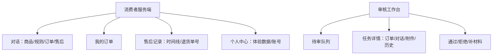
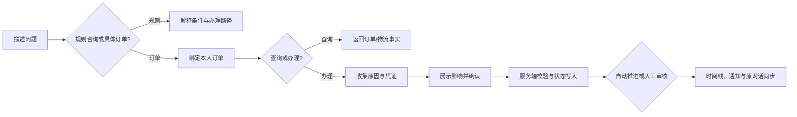
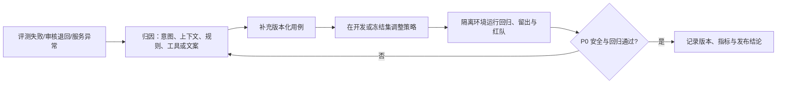

# 产品需求说明书

# 店小服｜智能电商客服 Agent

| 文档项 | 内容 |
| --- | --- |
| 文档版本 | V1.2 |
| 文档状态 | 产品方案 |
| 产品形态 | 面向消费者与售后审核员的双端智能客服工作台 |
| MVP 优先用户 | 有商品、订单、物流或售后问题，希望通过自然语言完成查询或申请的电商消费者 |
| 项目周期 | 2025.09—2026.02 |
| 本次修订 | 2026-02-28 |

精简版见 [PRD 精简版](./ShopCare_PRD_精简版.md)。

## 修订记录

| 版本 | 日期 | 修订说明 |
| --- | --- | --- |
| V1.0 | 2025-09-01 | 建立产品目标、服务闭环、角色分工与核心范围。 |
| V1.1 | 2025-11-15 | 补充订单服务、售后状态、审核协同与关键交互。 |
| V1.2 | 2026-02-28 | 收敛 MVP，补充需求依据、产品决策、功能验收、安全与 AI 评测闭环。 |

## 目录

1. 产品摘要
2. 背景、问题定义与市场研究
3. 用户、场景与价值主张
4. 产品目标、非目标与设计原则
5. 竞品分析与关键产品决策
6. MVP 范围、信息架构与核心流程
7. 功能需求、优先级与验收标准
8. Agent、知识库、工具与用户职责边界
9. 异常、撤销与可信服务处理
10. 数据安全、权限与隐私
11. 埋点、指标体系与 AI 评测
12. 非功能需求、风险与版本规划

---

# 1. 产品摘要

店小服是面向电商消费者的智能客服 Agent。用户可在同一对话入口咨询商品与规则、查询本人订单和物流、发起售后、补充凭证并跟进处理进度；审核员在工作台处理需要人工核实的申请。

MVP 不追求覆盖所有电商交易和商家运营能力，而是建立一条可信服务闭环：**自然语言描述 → 绑定本人订单 → 规则与状态核验 → 明确确认 → 自动推进或人工审核 → 状态回流**。大模型负责理解、追问和解释；订单、金额、状态与写操作由受控业务服务完成。模型不能仅凭文本修改订单或给出退款结论。

| 版本范围 | 说明 |
| --- | --- |
| MVP 核心闭环 | 账号登录/注册、会话与订单绑定、商品推荐及规格追问、政策咨询、订单/物流查询、催发货、取消订单、改址、拦截、退货退款/仅退款/换货、问题件凭证、售后记录、审核队列与状态同步。 |
| P1 复用能力 | 历史会话、未读提醒、个人中心、审核历史、风险筛选与实时刷新。 |
| P2 规模化能力 | 规则配置后台、真实商家/物流系统集成、SLA 与运营看板、多商家及组织级权限。 |

# 2. 背景、问题定义与市场研究

## 2.1 使用场景与核心矛盾

消费者遇到问题时，常从一句“我要退”“物流到哪了”“地址写错了”开始。句子短，但背后可能涉及订单归属、商品状态、物流节点、退款路径、凭证和人工判断。FAQ 可以解释规则，却难以承接订单事实与连续状态；让模型直接根据语言修改订单，又会带来误操作、越权和虚构结果的风险。

核心矛盾是：

> 消费者能够用自然语言描述服务诉求，但电商服务的结果必须基于正确的订单、规则、状态与确认，而不能由模型自行假设。

| 现有方式 | 对服务任务的限制 | 店小服优先解决什么 |
| --- | --- | --- |
| FAQ / 帮助中心 | 能解释通用规则，用户仍需自行找到订单与办理入口。 | 先解释，再在需要办理时连接本人订单与下一步。 |
| 订单页与售后页 | 订单事实清楚，但用户需逐页寻找入口并重复描述原因。 | 用对话承接描述，用订单卡片和售后记录承接业务对象。 |
| 人工客服 | 能处理例外，但审核员要重复收集订单、对话和证据。 | 将人工审核置于同一服务链路，自动带入上下文。 |
| 通用大模型 | 表达自然，但没有订单归属、金额和状态事实。 | 将模型限制在理解与表达层，把事实和写入交给受控服务。 |

## 2.2 市场研究与产品判断

| 公开研究信号 | 可引用数据 | 对产品定义的启示 |
| --- | --- | --- |
| 消费者服务正在由自动化与人工协同承接 | [McKinsey：The state of AI in early 2024](https://www.mckinsey.com/capabilities/quantumblack/our-insights/the-state-of-ai) 显示，65% 的受访组织已在至少一个业务职能中经常使用生成式 AI。 | 智能客服的价值不只在问答，而在于把自然语言接入可验证的业务流程。 |
| 交易与履约数据需要共同支撑售后判断 | [Olist Brazilian E-Commerce Public Dataset](https://www.kaggle.com/datasets/olistbr/brazilian-ecommerce) 提供订单、订单项、支付、评价、卖家、客户与物流时间戳关联数据。 | 售后不能只凭用户一句描述；订单、金额、履约节点和历史沟通共同构成判断依据。 |
| 交易明细包含商品、数量、价格与取消事实 | [UCI Online Retail Dataset](https://archive.ics.uci.edu/dataset/352/online+retail) 提供交易、商品、数量、单价和客户取消记录。 | 退款、退货和换货必须关联到具体订单事实，避免模糊文本直接触发执行。 |

| 产品判断 | 对应设计 |
| --- | --- |
| 用户需要一个统一服务入口，但不需要所有问题都先选订单。 | 商品和政策咨询可直接发起；具体查询与办理时再绑定订单。 |
| 可信度来自业务事实与状态，而不是模型措辞。 | 订单、物流、金额、资格和状态由服务端返回；模型不直接写入。 |
| 高影响动作必须可理解、可拒绝、可追溯。 | 取消、改址、拦截和售后提交统一采用确认和二次校验。 |
| 人工审核是复杂服务的组成部分。 | 审核任务带入订单、会话、附件、规则检查和操作历史。 |

# 3. 用户、场景与价值主张

## 3.1 MVP 用户与非优先用户

| 用户 | 场景与目标 | MVP 优先级 |
| --- | --- | --- |
| 电商消费者 | 咨询商品、规则、订单、物流和售后；希望快速知道下一步并持续跟进。 | 优先用户 |
| 售后审核员 | 核实证据不足、商品问题或高风险申请，并将结论回传。 | 优先用户 |
| 客服/运营负责人 | 维护服务规则、复盘审核原因和质量问题。 | 可使用，但不设计为复杂运营后台。 |
| 商家、支付方、物流方、企业管理员 | 处理履约、清算、商家经营、组织权限。 | 后续版本重点。 |

## 3.2 核心任务与成功定义

> 当我遇到商品、订单或售后问题时，我希望用一句自然语言描述需求，就能基于可信订单和规则获得答复或完成申请；如果需要人工处理，我能在原入口持续看到进度，而不用重复说明情况。

| 核心任务 | 用户完成标准 |
| --- | --- |
| 商品与规则咨询 | 获得商品、规格、库存或政策条件，并能继续追问。 |
| 订单与物流服务 | 仅查看本人订单；知道订单现状、物流事实和可选操作。 |
| 发起售后 | 在对象、原因、凭证和确认充分时创建一笔可追踪申请。 |
| 进度与补充 | 在原对话和售后记录看到同一状态、审核说明和下一步。 |
| 人工审核 | 审核员在一个任务中完成判断，结果同步回消费者。 |

## 3.3 产品定位与价值主张

店小服不是只回答政策的聊天机器人，也不替代真实支付和物流系统。它是面向电商服务任务的对话式工作台：把**自然语言理解、受控业务执行、售后状态和人工审核**组合起来，让消费者可以完成一次可跟进的服务请求。

# 4. 产品目标、非目标与设计原则

## 4.1 产品目标与非目标

| 类型 | 内容 |
| --- | --- |
| 产品目标 | 让消费者在同一入口完成商品/规则咨询、本人订单服务和售后主链路。 |
| 可信目标 | 订单归属、金额、物流和售后状态均由业务服务确认；高影响动作必须经确认和二次校验。 |
| 效率目标 | 减少订单页、帮助中心、聊天入口与售后页之间的切换，不以固定秒级响应作为产品承诺。 |
| 非目标 | 不在 MVP 提供下单、支付、真实物流、真实商家系统、营销或商家经营后台。 |
| 非目标 | 不展示模型内部推理，不让模型直接决定退款金额、审核结论或业务写入。 |

## 4.2 产品设计原则

| 原则 | 解决的问题 | 产品要求 |
| --- | --- | --- |
| 先解释，后办理 | 用户可能先问通用规则，未必准备操作订单。 | 政策咨询不强制选择订单；进入办理时再校验订单与资格。 |
| 关键动作确认 | 模糊确认可能造成错改地址、取消或退款。 | 展示对象、影响和下一步；确认仅对当前订单和当前动作生效。 |
| 业务事实优先 | 自然语言答案可能与订单事实冲突。 | 订单、物流、金额、状态和资格来自受控服务。 |
| 状态连续可恢复 | 用户需要看到申请之后的处理进展。 | 售后记录和时间线作为真值，对话、通知和审核端同步读取。 |
| 证据优先 | 商品问题和少件不能靠模型猜测。 | 图片凭证与问题说明进入同一申请，供人工审核查看。 |
| 失败显式反馈 | 伪造成功会破坏信任。 | 订单不匹配、信息不足、工具失败或状态不支持时说明原因与下一步。 |

# 5. 竞品分析与关键产品决策

## 5.1 竞品范式与机会判断

| 维度 | 传统 FAQ | 平台订单/售后页 | 通用大模型 | 店小服 |
| --- | --- | --- | --- | --- |
| 核心能力 | 规则解释 | 订单事实与标准办理 | 自然语言理解与表达 | 对话理解 + 订单事实 + 状态闭环 |
| 入口方式 | 按问题检索 | 从具体订单进入 | 自由提问 | 先对话，具体办理时绑定订单 |
| 多轮追问 | 弱 | 围绕单页操作 | 强但缺业务事实 | 保留订单锚点、待确认动作与售后状态 |
| 高风险动作 | 通常不办理 | 由规则与表单限制 | 缺少业务边界 | 确认、归属、状态和服务端校验 |
| 复杂售后 | 转人工入口分散 | 常需切换页面 | 无人工流程 | 审核任务带入会话、附件与订单信息 |

结论：店小服不以替代成熟电商平台的全部交易能力为目标，而是降低消费者从“描述问题”到“进入正确、可跟进服务路径”的成本。

## 5.2 关键产品决策与取舍

| 决策 | 用户问题 | 选择方案 | 暂缓方案 | 选择理由与风险 |
| --- | --- | --- | --- | --- |
| 对话优先，订单锚定 | 用户表达自然但办理必须准确。 | 对话承接诉求，具体查询/写入绑定本人订单。 | 所有问题先进入订单表单。 | 减少入口阻力；风险是对象不明，需澄清或选择订单。 |
| 确认后执行 | 取消、改址、拦截和退款影响权益。 | 说明影响后要求明确确认，再由服务端二次校验。 | 仅凭一次关键词或前端按钮写入。 | 防止误执行；风险是多一步交互，需用清晰文案降低负担。 |
| 状态记录为真值 | 聊天文本难以恢复和跨端同步。 | 售后申请、时间线、通知和审核日志持久化。 | 只保存对话文本。 | 支持刷新、重登和人工回写。 |
| 商品问题先补证 | 破损、少件、错发需要事实基础。 | 支持图片凭证与补材料后重新审核。 | 由模型根据描述直接判定。 | 提升可审核性；风险是用户材料不足，需明确告诉用户拍什么。 |
| 审核任务聚合 | 人工判断需要完整上下文。 | 单个任务展示用户、订单、申请、附件、对话、检查和历史。 | 只创建没有上下文的转人工消息。 | 减少重复沟通；风险是审核说明需要区分对用户与内部信息。 |

# 6. MVP 范围、信息架构与核心流程

## 6.1 需求优先级与版本边界

| 优先级 | 范围 | 边界与说明 |
| --- | --- | --- |
| P0：核心闭环 | 账号、订单和会话；商品推荐/详情/规格/库存；规则咨询；订单/物流查询；催发货、取消、改址、拦截；售后申请、图片凭证、退货单号、时间线、通知；审核队列和三类决定。 | 商品目录、订单、物流和退款结果为隔离演示数据；图片仅支持 JPG/JPEG/PNG/WEBP/GIF，单张不超过 5MB。 |
| P1：留存与审核效率 | 历史会话、个人中心、未读提醒、审核历史、风险筛选、实时刷新。 | 用于连续服务与审核复盘，不改变 P0 状态规则。 |
| P2：规模化扩展 | 规则配置、真实商家/物流系统、SLA、运营看板、组织权限。 | 先满足数据、权限、审计和系统对接条件，再进入规模化使用。 |

## 6.2 信息架构

## 6.3 核心用户流程

*图 1：消费者登录。登录后加载当前账号的订单、会话和售后记录。*

*图 2：商品推荐。用户可继续查看详情或选择规格。*

*图 3：我的订单。用户从具体订单进入咨询。*

# 7. 功能需求、优先级与验收标准

## 7.1 FR-01 账号、订单与会话（P0）

| 项目 | 需求 |
| --- | --- |
| 用户目标 | 登录后查看本人订单，从订单或聊天发起咨询，并回看历史会话。 |
| 前置条件 | 消费者完成登录；审核员从独立入口登录。 |
| 主流程 | 登录/注册 → 加载订单、售后和会话 → 点击“咨询此订单”或聊天中选择订单 → 对话绑定订单卡。 |
| 异常流程 | 未登录跳转登录；管理员跳转审核台；非本人订单不返回详情。 |
| 输入与输出 | 输入账号密码、昵称密码、订单选择、文本；输出身份、本人订单列表、会话与订单卡片。 |
| 状态与验收 | 注册生成独立体验订单；会话标题、订单锚点和消息持久化。消费者只能访问本人订单/会话；刷新或重登后能恢复会话和售后记录。 |

## 7.2 FR-02 商品推荐、详情与规则咨询（P0）

| 项目 | 需求 |
| --- | --- |
| 用户目标 | 用自然语言获得商品推荐、详情、规格/库存说明或平台规则解释。 |
| 前置条件 | 已进入聊天；规则咨询不要求绑定订单。 |
| 主流程 | 输入场景、品类、预算或规则问题 → 路由 → 返回商品卡或规则解释 → 继续追问详情、颜色、尺码、库存、补货或条件。 |
| 异常流程 | 非电商问题被范围门禁拦截；问题不明确时要求补充品类、预算、商品或订单。 |
| 输入与输出 | 输入自然语言；输出商品名称、价格、卖点、颜色、尺码、库存或规则条件与办理建议。 |
| 状态与验收 | 推荐上下文和规格选择写入会话，用于承接“第一款”“M 码”等短回复；不创建订单或支付。商品卡可继续查看详情/选择规格，规则咨询不改变订单状态。 |

## 7.3 FR-03 订单、物流与履约操作（P0）

| 项目 | 需求 |
| --- | --- |
| 用户目标 | 查询本人订单和物流，催发货，或取消订单、修改地址、申请物流拦截。 |
| 前置条件 | 已登录且已绑定本人订单；改址适用于未发货订单，拦截适用于已发货未签收订单。 |
| 主流程 | 选择订单/输入订单号 → 返回订单事实 → 选择操作 → 展示影响和确认 → 服务端二次校验后写入。 |
| 异常流程 | 订单不存在/不属于本人、状态不支持、地址字段不全、否定确认或切换订单时不写入。 |
| 输入与输出 | 输入订单、收件人/联系电话/详细地址、确认文本；输出订单/物流事实、确认提示或结果。 |
| 状态与验收 | 改址更新收货信息；取消创建退款处理中申请；拦截更新为“拦截中”；催发货或物流异常生成通知。无确认不取消、不改址、不拦截；已发货订单不可直接改址。 |

*图 4：改址信息收集。字段不完整时不提交修改。*

*图 5：改址确认。用户确认后，订单服务写入新地址。*

## 7.4 FR-04 售后申请与材料收集（P0）

| 项目 | 需求 |
| --- | --- |
| 用户目标 | 对本人订单申请退货退款、仅退款、换货，或处理破损、少件、错发。 |
| 前置条件 | 已登录并绑定订单；申请需要类型与原因；商品问题路径需要图片凭证。 |
| 主流程 | 表达诉求 → 识别类型 → 读取订单和已有申请 → 收集原因/凭证 → 展示路径并确认 → 创建申请。 |
| 异常流程 | 对象不明时选择订单；已有处理中申请时返回原申请；仅退款不适用时引导退货退款；缺证据时提示上传。 |
| 输入与输出 | 输入类型、原因、订单、图片、确认；输出资格/限制说明、申请编号、下一步和状态卡。 |
| 状态与验收 | 申请进入等待审核、等待寄回或退款处理中；补齐图片可使等待补充材料恢复等待审核。未绑定订单、缺关键材料或未确认时不创建申请；处理中申请不重复创建。 |

*图 6：规则咨询转入具体售后时，系统要求绑定订单。*

*图 7：需要人工核实的申请在确认后进入审核。*

## 7.5 FR-05 售后进度、退货单号与通知（P0）

| 项目 | 需求 |
| --- | --- |
| 用户目标 | 查看进度、审核说明和时间线；填写退货单号并收到状态提醒。 |
| 前置条件 | 当前账号已有售后申请。 |
| 主流程 | 进入售后记录或聊天状态卡 → 查看金额、状态、说明、时间线 → 在等待寄回时填写单号。 |
| 异常流程 | 非本人申请、状态不允许、空单号或请求失败时显示错误，不迁移状态。 |
| 输入与输出 | 输入退货单号、已读操作；输出申请记录、时间线、未读提醒。 |
| 状态与验收 | 等待用户寄回 → 退货运输中；审核和状态变更同步到时间线、通知和原对话。聊天、售后记录与通知显示同一申请状态；刷新和重登后可恢复。 |

## 7.6 FR-06 人工审核工作台（P0）

| 项目 | 需求 |
| --- | --- |
| 用户目标 | 审核员判断高风险或证据不足的售后，并同步明确结果。 |
| 前置条件 | 审核员已登录且存在等待审核任务。 |
| 主流程 | 打开队列 → 选择任务 → 查看用户、订单、售后、附件、会话、规则检查和历史 → 填写说明 → 通过/拒绝/要求补材料。 |
| 异常流程 | 无权限跳转后台登录；说明为空不可提交；已处理任务不可重复决策；附件为空展示空态。 |
| 输入与输出 | 输入审核决定与说明；输出队列、任务详情和处理反馈。 |
| 状态与验收 | 通过进入退款处理中；拒绝进入审核未通过；补材料进入等待补充材料；同步消息、通知、时间线和审核历史。单个任务页可查看订单、对话与附件。 |

*图 8：审核队列。待办与任务摘要按风险展示。*

*图 9：审核详情。审核员填写说明后通过、拒绝或要求补材料。*

## 7.7 需求总览

| 编号 | 功能 | 优先级 | 用户价值 | 版本范围 |
| --- | --- | --- | --- | --- |
| FR-01 | 账号、本人订单、会话和订单锚点 | P0 | 从正确业务对象开始服务。 | MVP |
| FR-02 | 商品推荐、规格/库存与规则咨询 | P0 | 降低查询与选购表达门槛。 | MVP |
| FR-03 | 订单、物流、催发货、取消、改址、拦截 | P0 | 用受控路径处理履约问题。 | MVP |
| FR-04 | 售后申请、材料收集和确认 | P0 | 形成可追踪申请，减少误提交。 | MVP |
| FR-05 | 售后记录、时间线、退货单号与通知 | P0 | 让用户持续知道进度和下一步。 | MVP |
| FR-06 | 审核队列、聚合详情与三类决定 | P0 | 让复杂售后能连续由人工接手。 | MVP |
| FR-07 | 会话历史、个人中心、未读提醒与审核历史 | P1 | 提升留存、恢复和审核效率。 | P1 |
| FR-08 | 规则配置、真实系统接入与运营看板 | P2 | 面向规模化运营与治理。 | P2 |

# 8. Agent、知识库、工具与用户职责边界

| 能力 | 大模型 | 知识库/确定性工具与系统 | 用户/审核员 |
| --- | --- | --- | --- |
| 理解服务诉求 | 识别意图、追问缺失信息、承接上下文。 | 提供当前订单、会话和可用动作约束。 | 用户描述目标并选择订单。 |
| 商品与政策回答 | 组织可理解的答复。 | 返回商品目录、规格、库存和政策事实。 | 用户继续追问或更正对象。 |
| 订单与物流查询 | 生成查询与说明。 | 按当前身份返回订单、金额、地址、状态和物流。 | 查看结果并选择下一步。 |
| 高影响动作 | 提示影响、请求确认、组织调用。 | 校验归属、状态、参数和确认后执行写入。 | 明确确认或取消。 |
| 售后申请 | 收集原因、判断缺失材料、解释路径。 | 创建申请、维护时间线、限制重复申请。 | 提供原因、图片和退货单号。 |
| 人工审核 | 提供结构化上下文和面向用户的说明草案。 | 聚合订单、附件、会话、检查与历史；写入审核结果。 | 审核员做通过、拒绝或补材料决定。 |

核心边界是：模型负责**理解、追问、解释**；知识库和工具负责**事实、校验、执行**；消费者负责**对象、材料与确认**；审核员负责**复杂判断与结论**。模型输出不能越过受控工具成为业务事实。

# 9. 异常、撤销与可信服务处理

| 场景 | 系统处理 | 用户可见反馈/下一步 |
| --- | --- | --- |
| 未选择订单或多笔候选 | 不执行订单操作。 | 选择订单或补充订单号、商品。 |
| 跨用户订单 | 不返回订单详情。 | 提示选择当前账号订单。 |
| 地址、原因或凭证缺失 | 保持收集状态。 | 指出缺少字段或材料。 |
| 用户否定、切换订单或诉求 | 清理旧待确认动作。 | 保留当前订单或重新确认。 |
| 重复提交/重复确认 | 返回已有申请与进度。 | 不生成重复申请或重复写入。 |
| 订单状态不支持 | 拒绝当前动作，不伪造成功。 | 说明限制与可选路径。 |
| 上传失败或文件不合规 | 不保存附件。 | 说明格式、大小或空文件问题。 |
| 推送、模型或工具失败 | 不写入未完成动作，以服务端状态恢复。 | 提示重新核实、重试或补充信息。 |
| 人工要求补材料 | 保留原申请、会话和附件。 | 在原对话补充图片后回到审核。 |

用户可撤销的是尚未确认的动作意图，或在允许状态撤销售后申请；已经发生的订单、审核和退款状态迁移保留在时间线中，不能通过对话文本静默改写历史事实。

# 10. 数据安全、权限与隐私

| 主题 | 安全要求 |
| --- | --- |
| 身份与隔离 | 订单、会话、售后、附件和通知按用户与角色隔离；服务端以认证身份决定归属。 |
| 订单与金额 | 订单金额、地址、物流、状态和退款资格由业务服务读取，不能由模型、用户文本或前端参数覆盖。 |
| 高影响写入 | 取消、改址、拦截、售后创建和审核决定在服务端校验归属、状态、确认和参数。 |
| 附件 | 图片与用户、会话、订单和申请关联；文件类型和大小在上传时校验。 |
| 隐私展示 | 消费者只见面向自己的结果与说明；风险信息、工具参数和调试日志不在消费者端展示。 |
| 提示注入 | 用户文本、附件文本和检索内容均视为不可信输入，不能改变权限、规则或工具边界。 |
| 演示数据 | 演示账号、订单和状态与真实交易隔离；付款、商家收货和退款完成由演示状态机呈现。 |

# 11. 埋点、指标体系与 AI 评测

## 11.1 指标体系

| 类别 | 指标 | 定义要点 |
| --- | --- | --- |
| 产品价值 | 服务任务完成率、首轮解决率、售后进度查看率、补材料完成率、人工审核闭环率 | 合法任务完成服务目标，或信息不足时完成正确澄清/转人工。 |
| Agent 任务 | 意图识别正确率、订单匹配正确率、工具调用成功率、澄清正确率、范围门禁绕过率 | 以版本化离线用例、状态副作用和工具轨迹判定。 |
| 安全质量 | 关键操作安全率、错误关键执行率、越权访问拦截率、重复提交拦截率 | 高影响动作同时满足归属、状态和确认。 |
| 服务效率 | 平均/P95 响应耗时、平均工具调用次数、审核等待时长、状态同步成功率 | 用于识别模型、工具与运营瓶颈。 |

最小埋点事件：`chat_submitted`、`order_bound`、`clarification_requested`、`confirmation_requested/answered`、`tool_started/succeeded/failed`、`after_sales_created/updated`、`attachment_uploaded`、`audit_created/decided`、`notification_read`、`session_restored/failed`。事件记录必要元数据与脱敏摘要。

## 11.2 AI 评测目标与数据集

离线评测直接驱动真实 HTTP/SSE 聊天链路，并在隔离 PostgreSQL、Redis、独立用户和订单数据中运行。每轮保存输入输出、路由、状态前后快照、工具轨迹、确认标记、耗时和人工复核队列。

| 项目 | 评测基线 |
| --- | --- |
| 基准集 | `release-v1`，共 132 个会话、198 轮中文对话。 |
| 覆盖 | 商品与政策、订单与物流、售后处理、模糊表达、多轮上下文、关键操作确认、跨用户访问、提示注入与非电商范围门禁。 |
| 组成 | 冻结回归集、密封留出集与红队用例。 |
| 断言 | 回复约束、执行路由、状态副作用、工具调用、确认标记、模型调用次数与响应耗时。 |
| 运行 | `release-v1-final-a-r4`，隔离环境真实 HTTP/SSE 运行。 |

## 11.3 保留的真实评测结果与迭代闭环

| 指标 | 结果 |
| --- | ---: |
| 任务完成率 | **98.48%（130 / 132）** |
| 意图识别正确率 | **100%** |
| 订单匹配正确率 | **100%** |
| 工具调用成功率 | **100%** |
| 关键操作安全率 | **100%** |
| 错误关键执行率 | **0%** |
| 非电商范围门禁绕过率 | **0%** |

# 12. 非功能需求、风险与版本规划

## 12.1 非功能需求

| 主题 | 要求 |
| --- | --- |
| 可用性 | 网络、模型和工具异常时返回可区分的失败状态，不将失败展示为成功。 |
| 性能 | 普通查询优先快速返回；审核与退款阶段不阻塞用户查看已有进度；以 P50/P95 持续观测。 |
| 一致性 | 售后申请和时间线是状态真值，对话、通知和审核任务由其同步。 |
| 可恢复性 | 刷新、重登、推送断开后重新拉取服务端状态。 |
| 可追溯性 | 关键迁移与审核决定记录操作者、时间、原因和前后状态。 |
| 可维护性 | 规则、工具契约和评测用例版本化；策略或工具变更后运行对应回归。 |

## 12.2 主要风险与应对

| 风险 | 影响 | 应对 |
| --- | --- | --- |
| 订单对象不明 | 查错订单或误操作。 | 订单锚定、多候选澄清、服务端归属校验。 |
| 模糊确认 | 错误取消、改址、拦截或申请。 | 绑定对象的确认、切换意图失效、写入前二次校验。 |
| 证据不足 | 无法处理商品问题或少件。 | 图片凭证、补材料状态和人工审核。 |
| 状态不同步 | 用户和审核员看到不同进度。 | 售后记录/时间线为真值，推送与轮询恢复。 |
| 模型越权或提示注入 | 信息泄露或绕过业务规则。 | 范围门禁、身份隔离、工具 Schema 与服务端校验。 |
| 将演示状态误作真实交易 | 产生错误服务预期。 | 明确演示数据边界，真实系统接入列为后续版本。 |

## 12.3 版本规划

| 阶段 | 目标 | 交付判断 |
| --- | --- | --- |
| 当前 MVP | 验证从自然语言到受控售后闭环。 | P0 验收通过，关键动作安全、状态可恢复、离线评测可复现。 |
| P1 | 提升会话留存、提醒和审核效率。 | 历史、个人中心、未读、审核历史和风险筛选的权限/恢复用例通过。 |
| P2 | 面向真实业务接入和规模化运营扩展。 | 先完成支付、物流、商家、规则治理和组织权限的对接条件评估。 |
