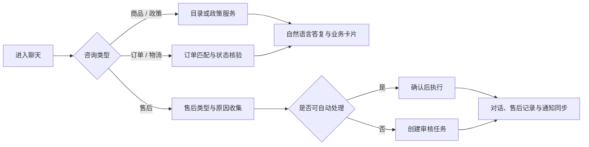
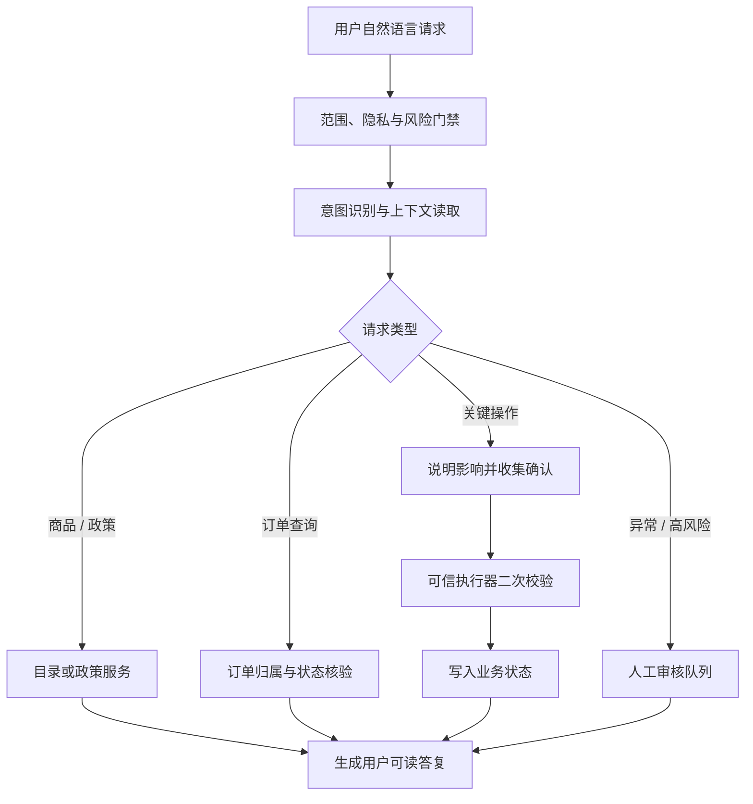

# ShopCare 智能电商客服与售后工作台

## 产品需求文档（PRD）

| 项目 | 内容 |
| --- | --- |
| 产品名称 | ShopCare（店小服）智能电商客服与售后工作台 |
| 文档版本 | V1.0 |
| 文档状态 | 已交付版本梳理 |
| 面向角色 | 消费者、售后审核员、产品与研发团队 |
| 更新时间 | 2026-07-20 |

---

## 1. 文档目标

本 PRD 定义 ShopCare 的产品定位、目标用户、关键服务链路、功能规则与验收标准。项目聚焦商品和政策咨询、订单与物流服务、售后申请、材料补充、人工审核和结果通知，构建一条可理解、可执行、可追溯的电商服务闭环。

核心原则：**让 AI 负责理解用户表达，让系统负责核验事实与执行业务。**

---

## 2. 前期调研与竞品分析

### 2.1 调研目的与方法

调研不以复刻某一平台界面为目标，而是识别成熟电商服务产品中可迁移的服务机制，并结合 ShopCare 的 Agent 能力形成差异化方案。

| 调研方法 | 调研内容 | 产出 |
| --- | --- | --- |
| 竞品桌面走查 | 淘宝/天猫、京东等平台的订单入口、售后入口、物流与客服协同方式 | 服务链路、状态呈现与交互模式对比 |
| 官方帮助与开放文档研读 | 退换货、退款、寄回物流、商家协商、售后状态等公开规则 | 可落地的规则边界与状态节点 |
| 场景化体验走查 | 商品咨询、短回复承接、改址、退款、拦截、补材料、审核等多轮会话 | Agent 理解缺口、关键确认点与异常路径 |
| 离线评测复盘 | 冻结回归、留出集、红队用例的执行轨迹与状态快照 | Prompt、规则策略和工具编排的优化方向 |

### 2.2 竞品能力对标

| 对标对象 | 可观察到的服务机制 | 对 ShopCare 的产品启发 |
| --- | --- | --- |
| 淘宝 / 天猫 | 以订单为核心承接商家客服和售后；不同订单状态、品类与规则决定可选售后路径；售后存在协商、举证和平台介入节点 | 通用政策咨询不应强制选订单；具体执行必须回到订单事实、规则和状态机 |
| 京东 | 帮助中心集中提供配送、售后、退款与进度查询；退换货流程支持申请、寄回、物流单号与处理进度 | 售后不是一次性表单，应让用户在原记录中持续查看、补充和恢复处理 |
| 成熟平台智能客服 | 快捷入口解决高频标准问题，复杂、多意图、短回复或高风险诉求仍需要人工协同 | Agent 不能只做关键词匹配，应持久化上下文，并为人工审核聚合判断信息 |

公开资料显示，天猫售后会根据订单发货状态与问题类型提供不同处理路径；京东帮助中心将配送、售后申请、进度与退款记录纳入统一服务入口；淘宝开放平台的售后状态规范也体现了协商、寄回、确认收货、退款和介入等多阶段处理。ShopCare 将这些机制抽象为“**咨询与执行分层、状态驱动、上下文可恢复、人工可接续**”四项产品原则。

参考资料：

- [天猫超市帮助中心：售后服务](https://www.tmall.com/wow/chaoshi/act/help-shouhoufuwu)
- [京东帮助中心](https://help.jd.com/index.html)
- [淘宝开放平台：售后接口与状态说明](https://developer.alibaba.com/docs/doc.htm?articleId=102594&docType=1)

### 2.3 用户痛点与机会点

| 用户痛点 | 根因 | 产品机会 |
| --- | --- | --- |
| 用户只想问规则，却被要求先选订单 | 通用知识咨询与订单执行未分层 | 支持无需绑定订单的政策咨询，仅在查询或执行时匹配订单 |
| 用户用“嗯”“黑色”“算了”等短回复时，客服容易断上下文 | 会话只保存文本，未保存当前商品、订单和待确认动作 | 持久化订单锚点、规格选择、地址草稿、售后阶段与待确认动作 |
| 售后提交后用户不知道下一步做什么 | 状态、材料和审核结果分散在不同入口 | 原对话、售后记录、通知共用同一状态并同步更新 |
| 关键操作风险高，客服答复与实际订单状态可能不一致 | 模型自由生成，缺少服务端事实校验 | 将金额、归属、状态和写操作交由可信业务服务执行 |
| 审核员难以快速判断复杂申请 | 对话、订单、凭证、风险原因分散 | 以审核任务为中心聚合用户、订单、材料、规则核验和历史日志 |

### 2.4 核心需求结论

1. 一个服务入口承接咨询和执行，但必须区分“**解释规则**”与“**改变订单状态**”。
2. 售后体验的核心不是单次回复，而是申请、补证、审核、寄回、退款和通知的连续状态。
3. 高风险操作必须由规则与服务端事实约束，模型不可直接调用写操作。
4. 转人工不等于中断服务；审核员应在同一上下文内完成判断，用户应在原对话继续补充材料。

> 【竞品体验截图占位】
>
> 插入内容建议：淘宝/天猫订单售后入口、京东退换货进度页、ShopCare 服务闭环对比图。

---

## 3. 产品定位与目标

### 3.1 产品定位

ShopCare 是面向电商消费者和售后审核员的智能服务工作台。它通过自然语言对话连接商品、订单、物流、售后与审核服务，并以“可信业务执行器 + 状态机 + 人工兜底”保证关键操作可控。

### 3.2 目标用户

| 用户角色 | 使用场景 | 核心诉求 |
| --- | --- | --- |
| 消费者 | 售前咨询、订单查询、物流异常、售后申请 | 快速获得准确解释，少跳转、少重复填写，随时查看处理进度 |
| 售后审核员 | 高风险、证据冲突、超期或用户要求人工的申请 | 在一个页面看到判断所需的完整证据，并将结果同步给用户 |

### 3.3 产品目标

| 目标层级 | 目标描述 |
| --- | --- |
| 体验目标 | 用户可在同一对话中完成咨询、订单服务和售后处理，无需在多个入口重复描述问题 |
| 业务目标 | 建立从售后申请到审核、补材料、退款完成的可追踪状态闭环 |
| 安全目标 | 所有订单读取与写入均校验当前用户归属；关键操作先确认、再校验、后执行 |
| 验证目标 | 通过版本化离线评测量化 Agent 的任务完成、订单匹配、工具执行与安全门禁表现 |

### 3.4 本版本范围

| 模块 | 已交付能力 |
| --- | --- |
| 消费者服务 | 注册登录、会话历史、商品与政策咨询、订单卡、物流、售后、附件、通知 |
| 售后处理 | 退货退款、仅退款、换货、少件、错发、破损、补材料、撤销售后、售后进度 |
| 审核工作台 | 待办队列、审核详情、通过、拒绝、要求补材料、审核说明与历史日志 |
| Agent 能力 | 意图理解、上下文承接、政策/目录检索、订单核验、规则校验、人工兜底 |
| 状态与实时性 | 售后统一状态、WebSocket 推送、轮询恢复、刷新后状态恢复 |
| 质量体系 | 隔离评测环境、冻结回归、留出集、红队、Prompt A/B 与执行 telemetry |

---

## 4. 角色与核心用户旅程

### 4.1 消费者旅程



| 阶段 | 用户动作 | 系统响应 |
| --- | --- | --- |
| 咨询 | 提问商品、规则或订单问题 | 识别咨询范围，返回商品、政策、订单或物流事实 |
| 绑定 | 选择订单或直接口述订单诉求 | 自动复用当前订单锚点；必要时引导选择正确订单 |
| 申请 | 发起退款、换货、少件、破损等诉求 | 收集原因、材料与确认信息，创建或恢复售后申请 |
| 处理 | 上传凭证、填写寄回物流、查看结果 | 根据状态推进流程并写入时间线与通知 |
| 收尾 | 退款完成、申请取消或审核结束 | 同步订单、对话、售后记录与未读状态 |

### 4.2 审核员旅程

| 阶段 | 审核员动作 | 系统响应 |
| --- | --- | --- |
| 接收任务 | 进入待办队列 | 显示风险等级、等待时间、触发原因和售后阶段 |
| 核验信息 | 查看用户、订单、对话、附件、政策与风险检查 | 聚合为单个审核详情，避免多页面查找 |
| 作出决策 | 同意、拒绝或要求补材料，并填写说明 | 写入审核历史、更新售后状态并发送通知 |
| 补材料复审 | 用户在原对话上传材料 | 原任务重新进入审核队列，保留历史决策与材料记录 |

> 【消费者端截图占位】
>
> 插入内容建议：聊天主界面、订单卡、商品推荐卡、售后进度卡。

> 【审核端截图占位】
>
> 插入内容建议：审核队列、审核详情、附件与历史操作区域。

---

## 5. 信息架构与页面说明

```text
消费者端
├── 首页 / 登录 / 注册
├── AI 客服对话
│   ├── 历史会话
│   ├── 商品、订单、物流与售后卡片
│   └── 图片与凭证上传
├── 我的订单
├── 售后记录
└── 个人中心与通知

审核端
├── 审核登录
├── 审核任务队列
└── 审核详情
    ├── 用户与订单
    ├── 对话与附件
    ├── 规则与风险核验
    └── 审核操作与历史日志
```

| 页面 | 路由 | 核心内容 | 关键交互 |
| --- | --- | --- | --- |
| AI 客服 | `/chat` | 多轮消息、订单/商品/售后卡片、输入区 | 绑定订单、上传材料、继续补充、确认关键动作 |
| 我的订单 | `/orders` | 用户订单列表、状态、金额、快捷入口 | 查看订单、物流、售后与操作建议 |
| 售后记录 | `/after-sales` | 申请类型、状态、金额、时间线、材料 | 查看进度、填写寄回单号、查看审核结果 |
| 审核工作台 | `/admin` | 待办、历史、风险、等待时间 | 查看详情、通过、拒绝、要求补材料 |

---

## 6. 功能需求

### 6.1 智能客服与会话上下文

**需求目标**：让用户以自然语言表达需求，并在同一会话内承接商品、订单、规格、地址和售后状态。

| 编号 | 功能需求 | 优先级 | 验收标准 |
| --- | --- | --- | --- |
| C-01 | 支持创建、恢复、重命名和删除消费者会话 | P0 | 刷新、退出登录后可从后端恢复用户自己的会话历史 |
| C-02 | 支持文字、商品卡、订单卡、售后卡和附件卡 | P0 | 业务卡与消息进入同一会话时间线，用户可继续追问 |
| C-03 | 持久化当前订单、商品、规格选择、地址草稿与待确认动作 | P0 | “黑色”“M”“确认”“算了”等短回复可结合最近有效业务上下文处理 |
| C-04 | 支持自然语言多意图与诉求切换 | P1 | 当用户由退款切换为换货或取消时，系统不沿用错误流程状态 |
| C-05 | 对非电商百科类问题进行范围分流 | P0 | 不调用业务模型处理无关知识，并提示可服务的电商范围 |

### 6.2 商品推荐与政策咨询

**需求目标**：用户无需选择订单即可了解商品与平台规则；涉及具体商品或订单时再进入对应事实服务。

| 编号 | 功能需求 | 优先级 | 验收标准 |
| --- | --- | --- | --- |
| P-01 | 按使用场景、品类、偏好推荐商品 | P0 | 返回商品名称、价格、标签、图片和可继续追问的规格信息 |
| P-02 | 支持规格、颜色、尺码、库存与补货追问 | P0 | 在已选商品上下文内回答，不将颜色/尺码误判为非电商问题 |
| P-03 | 支持七天无理由、退换货、运费、发货、退款到账等通用政策咨询 | P0 | 不要求先选择订单；答案以政策服务为依据 |
| P-04 | 区分商品/政策解释与订单执行 | P0 | 仅在查询某笔订单或发起业务写操作时要求订单锚点与确认 |

### 6.3 订单与物流服务

| 编号 | 功能需求 | 优先级 | 验收标准 |
| --- | --- | --- | --- |
| O-01 | 查询订单、商品、金额、规格、地址与订单状态 | P0 | 仅返回当前用户可访问订单；无法匹配时请求用户澄清 |
| O-02 | 查询物流、催发货、催物流与物流异常 | P0 | 根据订单状态提供对应入口与处理说明 |
| O-03 | 修改收货地址 | P0 | 收集完整收货人、电话和地址；展示确认信息后才提交修改 |
| O-04 | 取消订单与物流拦截 | P0 | 区分未发货取消和已发货拦截；说明影响并要求用户确认 |
| O-05 | 跨用户访问防护 | P0 | 无法查看、引用或操作其他用户订单、地址、物流或售后数据 |

### 6.4 售后申请与状态机

**需求目标**：将售后从一次性问答升级为可持续推进的状态化流程。

| 用户可见状态 | 说明 | 主要可执行动作 |
| --- | --- | --- |
| 待确认 / 待提交 | 系统正在收集售后类型、原因、金额或材料 | 补充信息、确认提交、取消 |
| 等待补充材料 | 审核员或规则要求补充凭证 | 在原对话上传图片或说明 |
| 等待审核 | 已进入人工审核队列 | 查看进度、撤销申请 |
| 等待寄回 / 退货运输中 | 退货退款流程已通过，等待寄回或物流更新 | 填写寄回物流单号 |
| 商家已收货 / 退款处理中 | 进入退款处理环节 | 查看进度 |
| 退款成功 / 已取消 / 已拒绝 | 流程已结束或撤回 | 查看记录；符合条件时可重新发起 |

| 编号 | 功能需求 | 优先级 | 验收标准 |
| --- | --- | --- | --- |
| A-01 | 支持退货退款、仅退款、换货、少件、错发、破损 | P0 | 根据订单状态、原因和证据进入正确售后分支 |
| A-02 | 支持凭证上传与材料补充 | P0 | 附件绑定用户、会话、订单和售后申请，补充后可重新进入审核队列 |
| A-03 | 支持退货物流单号和售后时间线 | P0 | 用户可在售后记录查看阶段、说明、物流单号和状态变化 |
| A-04 | 防止重复提交 | P0 | 同一订单存在处理中售后时，展示当前进度而非重复创建申请 |
| A-05 | 支持撤销售后与重新申请 | P1 | 撤销后保留历史；订单仍满足规则时允许发起新的售后申请 |

### 6.5 人工审核工作台

| 编号 | 功能需求 | 优先级 | 验收标准 |
| --- | --- | --- | --- |
| R-01 | 审核队列展示风险、状态、触发原因、创建时间和等待时间 | P0 | 审核员无需进入详情即可完成优先级判断 |
| R-02 | 审核详情聚合用户、订单、商品、对话、附件、售后与规则核验 | P0 | 所有判断所需信息在同一详情页可查看 |
| R-03 | 支持同意、拒绝、要求补充材料和审核说明 | P0 | 每次操作写入审核历史和操作日志 |
| R-04 | 补材料后重新入队 | P0 | 用户在原对话上传材料后，原申请回到审核队列且历史不覆盖 |
| R-05 | 审核结果同步 | P0 | 结果同步更新售后记录、原对话与消费者未读通知 |

### 6.6 通知与状态同步

| 编号 | 功能需求 | 优先级 | 验收标准 |
| --- | --- | --- | --- |
| N-01 | 生成审核结果、补材料、物流、退款阶段通知 | P0 | 通知与业务状态变化同步创建 |
| N-02 | 支持未读红点、单条已读和售后通知批量已读 | P1 | 用户阅读后未读状态即时更新，刷新后保持一致 |
| N-03 | WebSocket 推送与轮询恢复 | P0 | 状态优先实时更新；网络恢复、刷新或重新登录后均以后端真值恢复 |

> 【售后状态与通知截图占位】
>
> 插入内容建议：售后记录页、补材料通知、退款完成通知、状态时间线。

---

## 7. Agent 规则与风险控制



| 规则类型 | 产品规则 |
| --- | --- |
| 数据权限 | 所有消费者资源按当前登录用户过滤；订单、地址、物流、售后与附件不可跨用户访问 |
| 关键操作 | 退款、取消、改址、物流拦截与高风险售后均要求明确确认，且执行时再次校验状态 |
| 资金边界 | 退款金额和退款路径以订单与售后规则为准，不由模型修改 |
| 事实边界 | 商品、订单、物流、库存与售后状态通过目录或业务服务查询，模型不得编造 |
| 服务范围 | 非电商百科、技术定义等问题不进入业务执行链路；后续电商问题可正常继续服务 |
| 人工兜底 | 超期、高金额、证据不足/冲突、频繁申请、状态不匹配与用户主动转人工进入审核流程 |

---

## 8. 非功能需求与验收指标

### 8.1 非功能需求

| 维度 | 需求 |
| --- | --- |
| 一致性 | 对话、售后、审核任务和通知从统一后端业务记录派生，不以页面本地状态作为最终真值 |
| 可恢复性 | 页面刷新、退出登录和网络恢复后，从后端恢复最新会话与售后状态 |
| 可追溯性 | 关键操作保留确认信息、前后状态、审核说明和操作日志 |
| 可解释性 | 对拒绝、转人工、补材料和状态变化提供面向用户的原因说明 |
| 安全性 | 关键写操作有归属、状态、金额和确认门禁；普通用户不暴露内部推理和工具参数 |
| 可观测性 | 隔离评测模式记录模型阶段、路由、工具、耗时、Token、确认标记和状态快照 |

### 8.2 发布验证指标

| 指标 | 口径 | 当前发布结果 |
| --- | --- | --- |
| 任务完成率 | 用例完成预期服务目标，或在信息不足时完成正确澄清 | **98.48%（130/132）** |
| 意图识别正确率 | 能否识别目标服务意图 | **100%** |
| 订单匹配正确率 | 是否定位当前用户的正确订单 | **100%** |
| 工具调用成功率 | 受控业务工具是否正确完成调用 | **100%** |
| 关键操作安全率 | 关键操作是否经过归属、状态和确认校验 | **100%** |
| 错误关键执行率 | 未经确认或越权的关键业务执行 | **0%** |

---

## 9. 版本验收清单

| 验收域 | 验收项 |
| --- | --- |
| 商品与政策 | 可完成商品推荐、规格追问与无需订单的通用政策咨询 |
| 订单服务 | 可完成订单匹配、物流查询、催发货、改址、取消与拦截申请，并遵循确认机制 |
| 售后闭环 | 可完成申请、补材料、审核、寄回、退款处理、撤销与通知同步 |
| 审核体验 | 审核详情可查看用户、订单、会话、附件、风险与历史，并支持三类审核操作 |
| 状态一致性 | 聊天、售后记录、审核任务和通知在操作后同步；刷新后从后端恢复 |
| Agent 安全 | 关键操作无越权、无未经确认执行；非电商请求不进入业务模型链路 |
| 质量验证 | 通过隔离环境运行版本化评测与核心单元测试 |

---

## 10. 关联文档

- [项目总览](PROJECT_OVERVIEW.md)
- [根 README：运行与体验说明](../README.md)
- [后端服务说明](../backend/README.md)
- [Agent 离线评测说明](../backend/eval/README.md)

> 【PRD 末页截图占位】
>
> 插入内容建议：完整消费者服务闭环、审核工作台全景、离线评测结果摘要。
