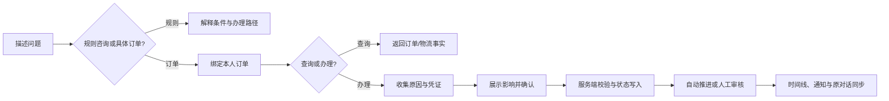

# 店小服｜智能电商客服 Agent

## 产品需求说明书（精简版）

| 项目 | 内容 |
| --- | --- |
| 产品定位 | 面向消费者的对话式电商服务工作台，连接订单、售后与人工审核 |
| 核心用户 | 有商品、订单、物流或售后问题，希望通过自然语言快速获得处理路径的电商消费者 |
| 核心价值 | 让自然语言诉求进入基于订单事实、规则校验与状态追踪的可信服务闭环 |
| 项目周期 | 2025.09—2026.02 |

完整版见 [产品需求说明书](./ShopCare_PRD.md)。

## 1. 问题与机会

消费者常以“我要退”“物流到哪了”“地址写错了”等短句发起服务，但实际处理需要定位订单、判断履约状态、收集材料、确认影响并持续跟进。FAQ 能解释政策，订单页能呈现事实，人工客服能处理例外，但三者之间仍存在入口切换、重复描述和上下文断裂。

| 研究信号 | 产品机会 |
| --- | --- |
| [McKinsey：The state of AI in early 2024](https://www.mckinsey.com/capabilities/quantumblack/our-insights/the-state-of-ai) 显示，65% 的受访组织已在至少一个业务职能中经常使用生成式 AI。 | 智能客服不只要回答问题，还需要把自然语言接入可验证的业务流程。 |
| [Olist Brazilian E-Commerce Public Dataset](https://www.kaggle.com/datasets/olistbr/brazilian-ecommerce) 提供订单、订单项、支付、评价与物流时间戳关联数据。 | 售后判断需要订单、金额、履约节点和历史沟通共同支撑，不能仅依据一句描述。 |
| [UCI Online Retail Dataset](https://archive.ics.uci.edu/dataset/352/online+retail) 包含商品、数量、价格、客户与取消记录。 | 退款、退货和换货必须关联订单事实，避免模糊文本直接触发执行。 |

核心矛盾：消费者能够自然描述问题，但电商服务的结果必须基于正确订单、规则、状态和确认，不能由模型自行假设。

## 2. 产品定义

店小服把商品与规则咨询、本人订单与物流查询、售后申请、补材料、审核和进度跟进放入同一服务入口。大模型负责理解、追问和解释；知识库、规则与受控服务负责事实读取、资格校验、状态写入与通知；审核员负责复杂申请的最终判断。

*消费者登录后进入与本人订单、会话和售后记录关联的服务空间。*

## 3. 目标用户与核心场景

| 场景 | 用户任务 | 交付结果 |
| --- | --- | --- |
| 商品咨询 | 描述场景、预算或品类，继续问规格和库存。 | 商品卡片、详情、颜色、尺码、库存说明。 |
| 政策咨询 | 了解退货、仅退款、运费、价保或物流拦截条件。 | 条件、例外与办理路径；不改变订单。 |
| 订单与物流 | 查询本人订单、物流、催发货或物流异常。 | 订单状态、物流事实与可选下一步。 |
| 履约操作 | 取消未发货订单、改址或申请拦截。 | 展示影响、确认后执行并同步订单状态。 |
| 售后申请 | 申请退货退款、仅退款、换货、破损/少件处理。 | 申请编号、材料要求、当前阶段和下一步。 |
| 人工审核 | 审核员处理证据不足、商品问题或高风险申请。 | 审核说明、通过/拒绝/补材料结果同步消费者端。 |

## 4. 产品策略

| 设计原则 | 设计落点 |
| --- | --- |
| 先解释，后办理 | 规则咨询不强制选订单；具体查询和办理时再绑定本人订单。 |
| 业务事实优先 | 订单、金额、物流、资格和状态来自受控服务，模型不直接写入。 |
| 确认后执行 | 取消、改址、拦截和售后提交均展示对象与影响，经明确确认后执行。 |
| 状态连续可恢复 | 售后记录和时间线为真值，对话、通知和审核端读取同一状态。 |
| 证据优先 | 破损、少件、错发等问题收集图片凭证并进入人工核实。 |
| 失败显式反馈 | 信息不足、状态不支持、工具失败或网络异常时说明原因与下一步。 |

## 5. MVP 与版本边界

| 优先级 | 范围 | 成功判断 |
| --- | --- | --- |
| P0 | 登录/注册、订单与会话、商品与政策咨询、订单/物流查询、催发货、取消、改址、拦截、售后申请、图片凭证、退货单号、时间线、通知、审核队列与决策。 | 用户完成“描述问题 → 绑定订单 → 核验确认 → 处理或审核 → 查看进度”闭环。 |
| P1 | 历史会话、未读提醒、个人中心、审核历史、风险筛选、实时刷新。 | 用户可恢复服务上下文，审核员可复盘已处理任务。 |
| P2 | 规则配置后台、真实商家/物流系统、SLA 与运营看板、组织权限。 | 面向规模化运营与真实系统协作。 |

## 6. 核心流程与功能验收

| 功能 | 关键规则 | 验收标准 |
| --- | --- | --- |
| 账号、订单与会话 | 消费者只访问本人订单、会话和售后；订单可作为对话锚点。 | 从订单进入咨询后展示正确订单；刷新或重新登录后可恢复会话与售后记录。 |
| 商品与规则咨询 | 商品卡片支持详情、规格、库存追问；规则咨询不需要订单。 | 商品咨询不创建订单或支付；范围外问题不输出无关知识。 |
| 订单与履约操作 | 改址适用于未发货订单；拦截适用于已发货未签收订单。 | 无确认不取消、不改址、不拦截；状态不支持时说明限制。 |
| 售后申请与材料 | 申请需绑定订单、类型、原因；商品问题需图片凭证。 | 信息或材料不足、未确认时不创建申请；处理中申请不重复创建。 |
| 售后进度与通知 | 等待寄回时填写退货单号；审核结论同步状态与时间线。 | 对话、售后记录和通知显示同一申请状态；刷新后可恢复。 |
| 审核工作台 | 单任务展示订单、对话、附件、检查和历史；决定必须带说明。 | 通过、拒绝、补材料结果同步消费者端，已处理任务不可重复决策。 |

## 7. 责任边界

| 能力 | 大模型 | 知识库/工具/系统 | 消费者与审核员 |
| --- | --- | --- | --- |
| 理解诉求 | 识别意图、追问、承接上下文。 | 提供当前订单、会话和可用动作约束。 | 消费者描述问题、选择订单。 |
| 商品与规则 | 组织易懂答复。 | 返回商品目录、规格、库存和政策事实。 | 消费者继续追问或修正对象。 |
| 订单与售后 | 提示影响、请求确认、组织调用。 | 校验归属、状态、参数并执行写入。 | 消费者提供原因、材料和确认。 |
| 人工审核 | 汇总上下文和生成说明草案。 | 聚合订单、附件、会话、检查与历史。 | 审核员通过、拒绝或要求补材料。 |

## 8. 关键体验

*商品推荐与规格追问在同一会话内完成。*

*改址先收集完整信息，再请求确认。*

*规则咨询转为具体售后时，系统要求绑定订单。*

*审核员查看订单、附件和对话后，通过、拒绝或要求补材料。*

## 9. 异常、安全与可信服务

| 场景 | 产品处理 |
| --- | --- |
| 未选择订单或多笔候选 | 要求选择订单或补充订单号/商品，不执行订单操作。 |
| 跨用户订单 | 不返回订单、地址、金额或物流详情。 |
| 地址、原因或凭证缺失 | 指出缺少字段或材料，保持收集状态。 |
| 否定确认、切换订单或诉求 | 清理旧待确认动作，重新确认。 |
| 重复提交 | 返回已有申请和进度，不重复写入。 |
| 模型、工具、推送或网络失败 | 不写入未完成动作，提示重试或补充信息，并以服务端状态恢复。 |

订单、会话、售后、附件与通知按身份、角色和对象归属隔离；订单金额、物流、退款资格和状态由业务服务返回；用户输入、附件内容和检索内容不能改变权限、规则或工具边界。

## 10. 指标与评测

| 指标类别 | 核心指标 |
| --- | --- |
| 产品价值 | 服务任务完成率、首轮解决率、售后进度查看率、补材料完成率、人工审核闭环率。 |
| Agent 质量 | 意图识别正确率、订单匹配正确率、工具调用成功率、澄清正确率、范围门禁绕过率。 |
| 安全质量 | 关键操作安全率、错误关键执行率、越权访问拦截率、重复提交拦截率。 |
| 效率 | 平均/P95 响应耗时、工具调用次数、审核等待时长、状态同步成功率。 |

`release-v1-final-a-r4` 在隔离 HTTP/SSE 环境运行 **132 个会话、198 轮**，覆盖商品、政策、订单、物流、售后、多轮上下文、确认保护、跨用户访问、提示注入与范围门禁。

| 指标 | 结果 |
| --- | ---: |
| 任务完成率 | **98.48%（130 / 132）** |
| 意图识别正确率 | **100%** |
| 订单匹配正确率 | **100%** |
| 工具调用成功率 | **100%** |
| 关键操作安全率 | **100%** |
| 错误关键执行率 | **0%** |
| 非电商范围门禁绕过率 | **0%** |

## 11. 版本规划

| 阶段 | 重点 |
| --- | --- |
| MVP | 验证从自然语言到受控订单与售后服务闭环。 |
| P1 | 提升会话恢复、提醒、个人服务空间与审核复盘效率。 |
| P2 | 扩展真实商家/物流系统、规则治理、运营看板与组织级权限。 |

---

完整版见：[ShopCare_PRD.md](./ShopCare_PRD.md)。
