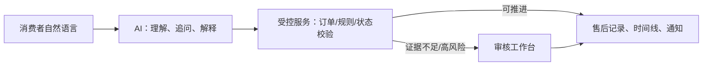

# 店小服 ShopCare｜智能电商客服 PRD（精简版）

> 用于招聘快速阅读；完整需求、验收、安全与评测细节见 [完整版 PRD](ShopCare_PRD.md)。

| 项目 | 内容 |
| --- | --- |
| 产品 | 消费者智能电商客服 + 售后审核工作台 |
| 用户 | 电商消费者、售后审核员、客服/运营负责人 |
| 核心问题 | 对话理解与订单事实脱节；关键动作误执行；售后进度不连续；人工审核信息分散。 |
| 定位 | AI 降低表达门槛，受控服务保障事实与执行，人工审核处理例外。 |

## 产品目标与边界

消费者在连续对话中完成商品/规则咨询、本人订单与物流查询、售后申请和进度跟进；取消、改址、拦截和售后提交均经“说明影响—确认—服务端校验”。审核结论同步回消费者对话、售后记录和通知。

不包含下单、支付、真实物流/商家系统或商家经营后台。退款与商家收货后续阶段由隔离演示状态机呈现。

## 核心设计

| 原则 | 做法 |
| --- | --- |
| 分层 | 通用规则不强制选订单；具体办理必须绑定本人订单。 |
| 受控 | 模型不直接写订单、地址、金额或审核结论。 |
| 确认 | 高影响动作必须绑定订单、动作与当前上下文。 |
| 连续 | 售后记录为状态真值，同步聊天、记录、通知和审核端。 |
| 可退出 | 商品问题、证据不足和高风险申请进入人工审核。 |

## P0 MVP

| 能力 | 用户可操作结果 | 验收要点 |
| --- | --- | --- |
| 登录、订单与会话 | 查看本人订单，从订单进入对话，回看历史咨询 | 不显示他人订单；刷新后恢复。 |
| 商品与规则咨询 | 商品卡片、详情/规格/库存追问、政策解释 | 不创建订单/支付；规则咨询不改订单。 |
| 订单与物流服务 | 查订单物流、催发货、取消、改址、拦截 | 无确认不写入；状态不支持时解释原因。 |
| 售后申请与凭证 | 退货退款、仅退款、换货、破损/少件 | 未绑定订单、缺材料或未确认不建申请。 |
| 进度与通知 | 时间线、审核说明、填写退货单号 | 多入口状态一致，刷新后恢复。 |
| 审核工作台 | 通过、拒绝、要求补材料 | 必须填写说明；结果同步消费者端。 |

## 实际界面路径

规则咨询先回答条件；办理具体售后时再选订单。

申请在确认后进入人工核实，并保留对话上下文。

审核员查看订单、附件和会话，填写说明后通过、拒绝或要求补材料。

## 职责边界

| 角色 | 职责 |
| --- | --- |
| 消费者 | 选择订单、说明原因、上传图片、确认关键动作、跟进进度。 |
| AI | 意图识别、追问、解释规则/状态、调用受控服务。 |
| 知识库/规则/工具 | 返回商品与政策事实，校验归属/状态/参数并执行持久化写入。 |
| 审核员 | 对需人工核实的申请做通过、拒绝或补材料决定。 |

## 安全与评测

- 服务端按身份、角色和订单归属控制访问；模型、前端参数和用户文本不能覆盖业务事实。
- 图片凭证仅支持 JPG/JPEG/PNG/WEBP/GIF，单张不超过 5MB；异常、断线或服务失败默认不写业务数据。
- `release-v1-final-a-r4` 在隔离 HTTP/SSE 环境运行 **132 个会话、198 轮**：任务完成率 **98.48%（130/132）**、意图识别/订单匹配/工具调用成功率 **100%**、关键操作安全率 **100%**、错误关键执行率与范围门禁绕过率均为 **0%**。

## P1/P2

P1：会话历史、未读提示、个人中心、审核历史与风险筛选。P2：可配置规则后台、真实商家/物流接入、SLA 与运营看板。
