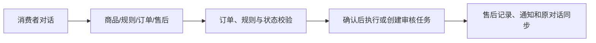
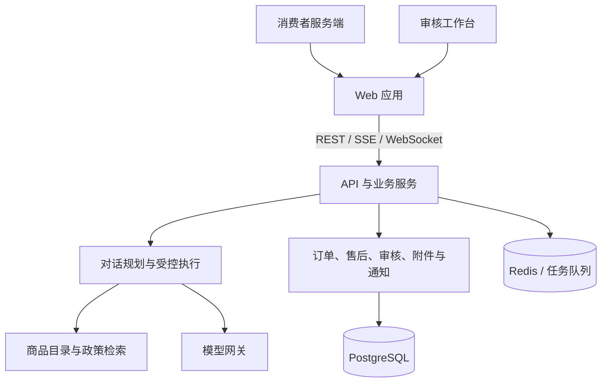

# ShopCare（店小服）项目总览

[README](../../README.md) · [完整 PRD](../ShopCare_PRD.md) · [PRD 精简版](../ShopCare_PRD_精简版.md) · [产品迭代与关键决策](../PRODUCT_DECISIONS.md) · [部署说明](../DEPLOYMENT.md)

## 产品定位

ShopCare 是面向电商消费者的智能客服与售后协同项目。消费者在对话中咨询商品、规则、订单、物流与售后；涉及具体业务时，系统以本人订单、规则和状态作为处理依据。审核员在工作台接续需要人工判断的申请，并将结果同步给消费者。

## 用户与主路径

| 角色 | 目标 | 主要入口 |
| --- | --- | --- |
| 消费者 | 用自然语言完成查询、申请、补材料与进度跟进。 | `/chat`、`/orders`、`/after-sales`、`/profile` |
| 售后审核员 | 在完整上下文下处理待审任务。 | `/admin` |

## 产品能力

| 场景 | 用户可见能力 | 处理方式 |
| --- | --- | --- |
| 商品与政策 | 商品推荐、详情、规格/库存追问；退换货、运费、价保等规则咨询。 | 商品目录与政策内容提供事实，通用咨询不要求绑定订单。 |
| 订单与物流 | 本人订单、物流、催发货、取消、改址、拦截。 | 具体操作绑定订单；高影响动作需要确认与服务端校验。 |
| 售后 | 退货退款、仅退款、换货、少件、错发、破损、凭证、退货单号和进度。 | 售后申请、时间线和通知承接处理状态。 |
| 人工审核 | 通过、拒绝、要求补材料与审核说明。 | 任务聚合订单、会话、附件、规则检查和历史。 |

## 系统架构

- **前端体验：** Next.js、React、TypeScript、Tailwind CSS。
- **服务能力：** FastAPI、SQLModel、JWT、SSE、WebSocket。
- **状态与基础设施：** PostgreSQL、Redis、Celery、Docker Compose。
- **Agent 设计：** 对话规划、政策检索、订单锚定、确认门禁与受控业务执行。

## 评测

`release-v1-final-a-r4` 在隔离 HTTP/SSE 环境运行 132 个会话、198 轮中文对话：任务完成率 98.48%（130/132），意图识别、订单匹配、工具调用成功率和关键操作安全率均为 100%。评测设计、策略对比与复现方式见 [Agent 离线评测说明](../../backend/eval/README.md)。

## 本地体验

- Web：`http://localhost:3000`
- API：`http://localhost:18001`
- 消费者：`10000001 / 123456`
- 审核员：`80000001 / 123456`

启动步骤见 [部署说明](../DEPLOYMENT.md)。
